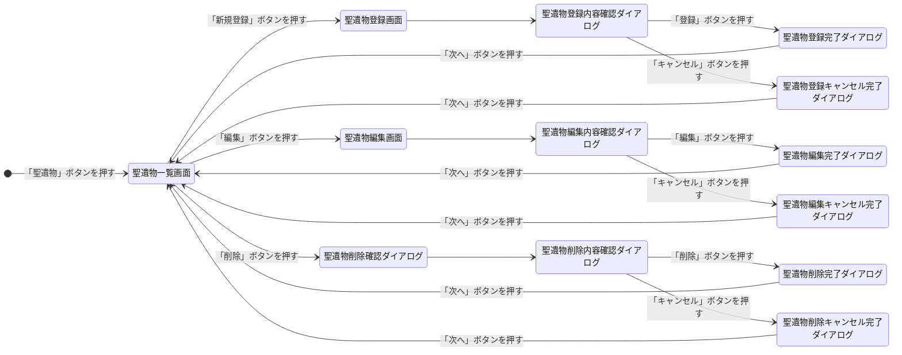
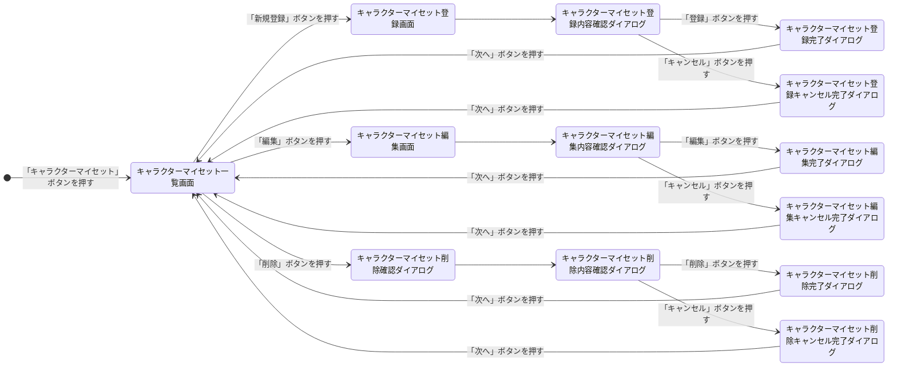
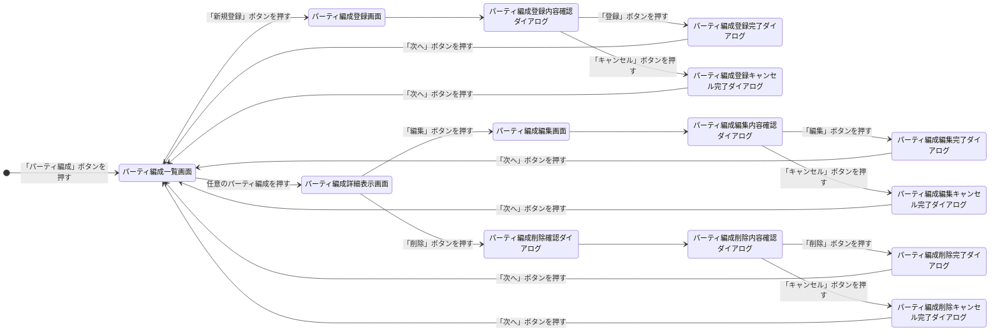
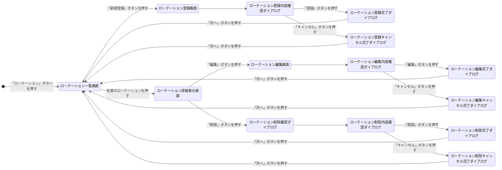
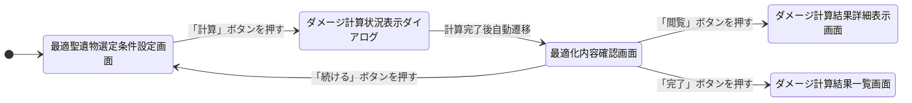
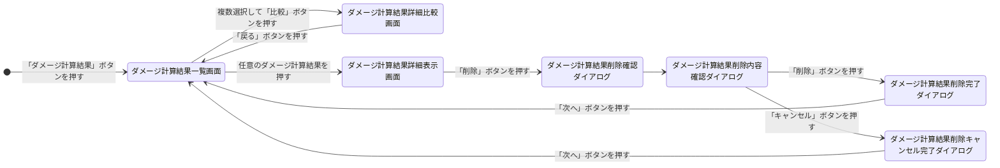

# GenshinDesktopApp

## 要件定義

### 目的

- 原神の所持聖遺物の中から 1 ローテーションの総ダメージが最大となるような聖遺物を選定する

### ユーザができること

- 所持している聖遺物データの自動取り込み
- 最適聖遺物セット選出
- 条件を変えて複数の構成でのダメージを比較
- GUI で操作
- 結果の保存と再読み込み

### 機能要件

| ID   | 機能                   | 内容                                                                     |
| ---- | ---------------------- | ------------------------------------------------------------------------ |
| F-01 | 聖遺物データの読み込み | 外部ファイル（例：JSON）から所持聖遺物情報を自動取り込み                 |
| F-02 | キャラクター選択       | 使用キャラクターを一覧から選択可能にする                                 |
| F-03 | 最適聖遺物の自動選定   | ダメージ計算に基づいて、対象キャラクターに最適な聖遺物セットを自動で決定 |
| F-04 | ダメージ計算           | 聖遺物とキャラクター情報に基づいて、想定ダメージを計算                   |
| F-05 | パーティ構成管理       | 複数キャラクターを組み合わせたパーティの構成を管理・保存                 |
| F-06 | 比較機能               | 条件を変えた構成間でのダメージを比較                                     |
| F-07 | 結果の保存・読み込み   | 計算結果や構成情報を保存し、後から読み込み可能                           |
| F-08 | GUI による操作         | Swing ベースのユーザーインターフェースで、視覚的に操作できるようにする   |

### 非機能要件

| ID   | 要件             | 内容                                                                                                                                             |
| ---- | ---------------- | ------------------------------------------------------------------------------------------------------------------------------------------------ |
| N-01 | 使用技術         | Java（JDK 17 以降推奨）、Swing、Maven を使用                                                                                                     |
| N-02 | 対応 OS          | Windows 10 / 11（他 OS は検証対象外）                                                                                                            |
| N-03 | 処理進捗の可視化 | ダメージ計算や聖遺物選定など処理に時間がかかる場合は、進捗バーや「残り時間の目安」などを画面上に表示してユーザーが待機時間を把握できるようにする |
| N-04 | データ形式       | 入出力ファイル形式は JSON を使用                                                                                                                 |
| N-05 | 保守性           | クラス・処理をモジュール単位に分離して保守性を高める                                                                                             |
| N-06 | UI 要件          | わかりやすく直感的な画面構成（ラベル・ボタン明示など）                                                                                           |
| N-07 | ログ出力         | 処理エラーや読み込み失敗時はログファイルに出力                                                                                                   |

### 保存対象の内容

基本的な保存形式は JSON 構造とする

#### 聖遺物構成

- 聖遺物部位（花・羽・時計・杯・冠）
- メインステータス（1 つ）
- サブステータス（最大 4 つ）
- 聖遺物セット名（例：剣闘士＋旧貴族など）
- 聖遺物レベル
- 聖遺物レアリティ
- スコアや評価値（例：会心率 ×2 ＋会心ダメ）

#### キャラクター構成

- キャラクター名
- レベル
- 突破レベル
- 命ノ星座の解放段階（0 ～ 6）
- 天賦レベル（通常、スキル、爆発）
- 武器
  - レベル
  - 突破レベル
  - 精錬ランク

#### パーティ構成

- パーティ名（任意の識別名）
- 選択キャラクター（最大 4 人）
- ロール（火力枠、バフ枠）
- 元素共鳴

#### ローテーション構成

- パーティ構成（パーティ構成参照）
- 行動順序の記録（例：ベネットスキル → 爆発 → 香菱スキル → 爆発 → 胡桃重撃など）
- 各行動のタイミング（UI 入力時は秒単位、処理はフレーム単位）
- ローテーション全体の時間（UI 入力時は秒単位、処理はフレーム単位）

#### シミュレーション構成

- ローテーション構成（ローテーション構成参照）
- 指定したキャラクター
- 最適化された聖遺物
- 敵のレベル・元素耐性
- バフ・デバフの有効／無効の切り替え（後日実装予定）
- キャラごとの総ダメージ（平均ダメージ・会心ダメージ・非会心ダメージの 3 種類）
- パーティ総ダメージ（平均ダメージ・会心ダメージ・非会心ダメージの 3 種類）
- キャラごとのダメージ割合（貢献率）
- ローテーション 1 周にかかる時間
- 経過時間当たりのダメージ分布（アクションごとに紐づけて管理）

## システム設計

### 外部設計

#### システム一覧

- 聖遺物管理システム
- キャラクターマイセット管理システム
- パーティ編成管理システム
- ローテーション管理システム
- 最適聖遺物選定システム
- ダメージ計算結果管理システム
- マスターデータ管理システム（あとでやる）

#### モジュール一覧

聖遺物管理システム

- 聖遺物登録モジュール
- 聖遺物編集モジュール
- 聖遺物削除モジュール
- 聖遺物一覧表示モジュール
- 聖遺物検索・フィルタ・ソートモジュール

キャラクターマイセット管理システム

- キャラクターマイセット編集モジュール
- キャラクター選択モジュール
- キャラクターレベル選択モジュール
- 天賦レベル選択モジュール
- 命ノ星座選択モジュール
- 武器選択モジュール
- 精錬ランク選択モジュール
- 聖遺物セット効果選択モジュール
- キャラクターマイセット削除モジュール
- キャラクターマイセット一覧表示モジュール
- キャラクターマイセット検索・フィルタ・ソートモジュール

パーティ編成管理システム

- パーティ編成編集モジュール
- パーティ編成登録モジュール
- パーティ編成削除モジュール
- パーティ編成一覧表示モジュール
- パーティ編成検索・フィルタ・ソートモジュール

ローテーション管理システム

- パーティ編成選択モジュール
- ローテーション編集モジュール
- ローテーション登録モジュール
- ローテーション複製モジュール
- ローテーション削除モジュール
- ローテーション一覧表示モジュール
- ローテーション検索・フィルタ・ソートモジュール
- ローテーション詳細表示モジュール

最適聖遺物選定システム

- ローテーション選択モジュール
- 対象キャラクター選択モジュール
- 仮想敵レベル選択モジュール
- 仮想敵耐性選択モジュール
- ダメージ計算モジュール

ダメージ計算結果管理システム

- ダメージ計算結果比較モジュール
- 最大ダメージ計算結果保存モジュール
- ダメージ計算結果削除モジュール
- ダメージ計算結果一覧表示モジュール
- ダメージ計算結果検索・フィルタ・ソートモジュール

#### 画面・ダイアログ一覧

聖遺物管理システム

- 聖遺物一覧画面
- 聖遺物登録画面
- 聖遺物編集画面
- 聖遺物登録内容確認ダイアログ
- 聖遺物登録完了ダイアログ
- 聖遺物登録キャンセル完了ダイアログ
- 聖遺物編集内容確認ダイアログ
- 聖遺物編集完了ダイアログ
- 聖遺物編集キャンセル完了ダイアログ
- 聖遺物削除確認ダイアログ
- 聖遺物削除内容確認ダイアログ
- 聖遺物削除完了ダイアログ
- 聖遺物削除キャンセル完了ダイアログ

キャラクターマイセット管理システム

- キャラクターマイセット一覧画面
- キャラクターマイセット登録画面
- キャラクターマイセット編集画面
- キャラクターマイセット登録内容確認ダイアログ
- キャラクターマイセット登録完了ダイアログ
- キャラクターマイセット登録キャンセル完了ダイアログ
- キャラクターマイセット編集内容確認ダイアログ
- キャラクターマイセット編集完了ダイアログ
- キャラクターマイセット編集キャンセル完了ダイアログ
- キャラクターマイセット削除確認ダイアログ
- キャラクターマイセット削除内容確認ダイアログ
- キャラクターマイセット削除完了ダイアログ
- キャラクターマイセット削除キャンセル完了ダイアログ

パーティ編成管理システム

- パーティ編成一覧画面
- パーティ編成登録画面
- パーティ編成詳細表示画面
- パーティ編成編集画面
- パーティ編成登録内容確認ダイアログ
- パーティ編成登録完了ダイアログ
- パーティ編成登録キャンセル完了ダイアログ
- パーティ編成編集内容確認ダイアログ
- パーティ編成編集完了ダイアログ
- パーティ編成編集キャンセル完了ダイアログ
- パーティ編成削除確認ダイアログ
- パーティ編成削除内容確認ダイアログ
- パーティ編成削除完了ダイアログ
- パーティ編成削除キャンセル完了ダイアログ

ローテーション管理システム

- ローテーション一覧画面
- ローテーション登録画面
- ローテーション詳細表示画面
- ローテーション編集画面
- ローテーション登録内容確認ダイアログ
- ローテーション登録完了ダイアログ
- ローテーション登録キャンセル完了ダイアログ
- ローテーション編集内容確認ダイアログ
- ローテーション編集完了ダイアログ
- ローテーション編集キャンセル完了ダイアログ
- ローテーション削除確認ダイアログ
- ローテーション削除内容確認ダイアログ
- ローテーション削除完了ダイアログ
- ローテーション削除キャンセル完了ダイアログ

最適聖遺物選定システム

- 最適聖遺物選定条件設定画面
- 最適聖遺物選定結果表示画面
- ダメージ計算結果詳細表示画面
- ダメージ計算結果一覧画面
- ダメージ計算状況表示ダイアログ

ダメージ計算結果管理システム

- ダメージ計算結果一覧画面
- ダメージ計算結果詳細表示画面
- ダメージ計算結果詳細比較画面
- ダメージ計算結果削除確認ダイアログ
- ダメージ計算結果削除内容確認ダイアログ
- ダメージ計算結果削除完了ダイアログ
- ダメージ計算結果削除キャンセル完了ダイアログ

#### 画面遷移図

聖遺物管理システム

---

キャラクターマイセット管理システム

---

パーティ編成管理システム

---

ローテーション管理システム

---

最適聖遺物選定システム

---

ダメージ計算結果管理システム

### 内部設計

#### 機能一覧

聖遺物管理システム

- 一覧表示機能
- 検索・フィルタ・ソート機能
- ゲーム内画像登録機能
- インポートファイル登録機能
- 抽出進行状況表示機能
- 登録結果表示機能
- 登録内容表示機能
- 登録完了表示機能
- 詳細表示機能
- 更新内容表示機能
- 更新完了表示機能
- 削除内容表示機能
- 削除完了表示機能

キャラクターマイセット管理システム

- 一覧表示機能
- 検索・フィルタ・ソート機能
- 手動登録機能
- インポートファイル登録機能
- 抽出進行状況表示機能
- 登録結果表示機能
- 登録内容表示機能
- 登録完了表示機能
- 詳細表示機能
- 更新内容表示機能
- 更新完了表示機能
- 削除内容表示機能
- 削除完了表示機能

パーティ編成管理システム

- 一覧表示機能
- 検索・フィルタ・ソート機能
- 手動登録機能
- インポートファイル登録機能
- 抽出進行状況表示機能
- 登録結果表示機能
- 登録内容表示機能
- 登録完了表示機能
- 詳細表示機能
- 更新内容表示機能
- 更新完了表示機能
- 削除内容表示機能
- 削除完了表示機能

ローテーション管理システム

- 一覧表示機能
- 検索・フィルタ・ソート機能
- 手動登録機能
- インポートファイル登録機能
- 抽出進行状況表示機能
- 登録結果表示機能
- 登録内容表示機能
- 登録完了表示機能
- 詳細表示機能
- 更新内容表示機能
- 更新完了表示機能
- 削除内容表示機能
- 削除完了表示機能

最適聖遺物選定システム

- 条件設定機能
- 選定進行状況表示機能
- 選定完了表示機能
- 選定結果表示機能

ダメージ計算結果管理システム

- 一覧表示機能
- 検索・フィルタ・ソート機能
- 手動登録機能
- インポートファイル登録機能
- 抽出進行状況表示機能
- 登録結果表示機能
- 登録内容表示機能
- 登録完了表示機能
- 詳細表示機能
- 更新内容表示機能
- 更新完了表示機能
- 削除内容表示機能
- 削除完了表示機能

#### 入出力仕様

聖遺物登録・編集モジュール

- 入力項目

| 項目名   | 型             | 必須 | Enum | 制約                          | 説明               |
| -------- | -------------- | ---- | ---- | ----------------------------- | ------------------ |
| id       | `UUID`         | ✅   | ⬜   |                               | 一意な ID          |
| set      | `ArtifactSet`  | ✅   | ⬜   |                               | 聖遺物のセット     |
| type     | `ArtifactType` | ✅   | ✅   |                               | 聖遺物の部位       |
| mainStat | `Stat`         | ✅   | ✅   | type によって選択肢条件あり   | メインオプション   |
| subStats | `List<Stat>`   | ✅   | ⬜   | 4 つかつ重複不可              | サブオプション     |
| rarity   | `Int`          | ✅   | ⬜   |                               | レア度             |
| level    | `Int`          | ✅   | ⬜   | rarity によって選択肢条件あり | 聖遺物のレベル     |
| score    | `Double`       | ✅   | ⬜   |                               | 聖遺物の会心スコア |

- 出力項目

| 項目名   | 型             | 必須 | Enum | 制約                     | 説明                           |
| -------- | -------------- | ---- | ---- | ------------------------ | ------------------------------ |
| status   | `StatusType`   | ✅   | ✅   | `success` または `error` | 処理結果のステータス           |
| message  | `String`       | ✅   | ⬜   |                          | status に応じたメッセージ      |
| set      | `ArtifactSet`  | ⬜   | ⬜   |                          | 聖遺物登録内容確認ダイアログ用 |
| type     | `ArtifactType` | ⬜   | ✅   |                          | 聖遺物登録内容確認ダイアログ用 |
| mainStat | `Stat`         | ⬜   | ✅   |                          | 聖遺物登録内容確認ダイアログ用 |
| subStats | `List<Stat>`   | ⬜   | ⬜   |                          | 聖遺物登録内容確認ダイアログ用 |
| rarity   | `Int`          | ⬜   | ⬜   |                          | 聖遺物登録内容確認ダイアログ用 |
| level    | `Int`          | ⬜   | ⬜   |                          | 聖遺物登録内容確認ダイアログ用 |
| score    | `Double`       | ⬜   | ⬜   |                          | 聖遺物登録内容確認ダイアログ用 |

キャラクターマイセット登録・編集モジュール

- 入力項目

| 項目名             | 型          | 必須 | Enum | 制約 | 説明                       |
| ------------------ | ----------- | ---- | ---- | ---- | -------------------------- |
| id                 | `UUID`      | ✅   | ⬜   |      | 一意な ID                  |
| character          | `Character` | ✅   | ⬜   |      | キャラクター               |
| characterLevel     | `Int`       | ✅   | ⬜   | 1-90 | キャラクターのレベル       |
| characterAscension | `Int`       | ✅   | ⬜   | 0-6  | キャラクターの突破段階     |
| talentLevels       | `List<Int>` | ✅   | ⬜   | 1-10 | キャラクターの各天賦レベル |
| constellation      | `Int`       | ✅   | ⬜   | 0-6  | キャラクターの命の星座     |
| weapon             | `Weapon`    | ✅   | ⬜   |      | キャラクターの武器         |
| weaponLevel        | `Int`       | ✅   | ⬜   | 1-90 | 武器のレベル               |
| weaponAscension    | `Int`       | ✅   | ⬜   | 0-6  | 武器の突破段階             |
| refinement         | `Int`       | ✅   | ⬜   | 1-5  | 精錬ランク                 |

- 出力項目

| 項目名             | 型           | 必須 | Enum | 制約                     | 説明                                           |
| ------------------ | ------------ | ---- | ---- | ------------------------ | ---------------------------------------------- |
| status             | `StatusType` | ✅   | ✅   | `success` または `error` | 処理結果のステータス                           |
| message            | `String`     | ✅   | ⬜   |                          | status に応じたメッセージ                      |
| character          | `Character`  | ⬜   | ⬜   |                          | キャラクターマイセット登録内容確認ダイアログ用 |
| characterLevel     | `Int`        | ⬜   | ⬜   |                          | キャラクターマイセット登録内容確認ダイアログ用 |
| characterAscension | `Int`        | ⬜   | ⬜   |                          | キャラクターマイセット登録内容確認ダイアログ用 |
| talentLevels       | `List<Int>`  | ⬜   | ⬜   |                          | キャラクターマイセット登録内容確認ダイアログ用 |
| constellation      | `Int`        | ⬜   | ⬜   |                          | キャラクターマイセット登録内容確認ダイアログ用 |
| weapon             | `Weapon`     | ⬜   | ⬜   |                          | キャラクターマイセット登録内容確認ダイアログ用 |
| weaponLevel        | `Int`        | ⬜   | ⬜   |                          | キャラクターマイセット登録内容確認ダイアログ用 |
| weaponAscension    | `Int`        | ⬜   | ⬜   |                          | キャラクターマイセット登録内容確認ダイアログ用 |
| refinement         | `Int`        | ⬜   | ⬜   |                          | キャラクターマイセット登録内容確認ダイアログ用 |

パーティ編成登録・編集モジュール

- 入力項目

| 項目名     | 型                | 必須 | Enum | 制約               | 説明                 |
| ---------- | ----------------- | ---- | ---- | ------------------ | -------------------- |
| id         | `UUID`            | ✅   | ⬜   |                    | 一意な ID            |
| name       | `String`          | ✅   | ⬜   |                    | パーティ名           |
| characters | `List<Character>` | ✅   | ⬜   | 1-4 人かつ重複不可 | 編成するキャラクター |
| roles      | `List<Role>`      | ✅   | ✅   | 火力枠またはバフ枠 | パーティでの役割     |

- 出力項目

| 項目名     | 型                | 必須 | Enum | 制約                     | 説明                                 |
| ---------- | ----------------- | ---- | ---- | ------------------------ | ------------------------------------ |
| status     | `StatusType`      | ✅   | ✅   | `success` または `error` | 処理結果のステータス                 |
| message    | `String`          | ✅   | ⬜   |                          | status に応じたメッセージ            |
| name       | `String`          | ⬜   | ⬜   |                          | パーティ編成登録内容確認ダイアログ用 |
| characters | `List<Character>` | ⬜   | ⬜   |                          | パーティ編成登録内容確認ダイアログ用 |
| roles      | `List<Role>`      | ⬜   | ✅   |                          | パーティ編成登録内容確認ダイアログ用 |

ローテーション登録・編集モジュール

- 入力項目

| 項目名  | 型             | 必須 | Enum | 制約 | 説明                       |
| ------- | -------------- | ---- | ---- | ---- | -------------------------- |
| id      | `UUID`         | ✅   | ⬜   |      | 一意な ID                  |
| party   | `Party`        | ✅   | ⬜   |      | 選択したパーティ編成       |
| actions | `List<Action>` | ✅   | ⬜   |      | スキルローテーションを記述 |

- 出力項目

| 項目名  | 型             | 必須 | Enum | 制約                     | 説明                                   |
| ------- | -------------- | ---- | ---- | ------------------------ | -------------------------------------- |
| status  | `StatusType`   | ✅   | ✅   | `success` または `error` | 処理結果のステータス                   |
| message | `String`       | ✅   | ⬜   |                          | status に応じたメッセージ              |
| party   | `Party`        | ⬜   | ⬜   |                          | ローテーション登録内容確認ダイアログ用 |
| actions | `List<Action>` | ⬜   | ⬜   |                          | ローテーション登録内容確認ダイアログ用 |

最適聖遺物選定モジュール

- 入力項目

| 項目名           | 型                 | 必須 | Enum | 制約 | 説明                   |
| ---------------- | ------------------ | ---- | ---- | ---- | ---------------------- |
| id               | `UUID`             | ✅   | ⬜   |      | 一意な ID              |
| rotation         | `Rotation`         | ✅   | ⬜   |      | 選択したローテーション |
| character        | `Character`        | ✅   | ⬜   |      | 最適化するキャラクター |
| enemyLevel       | `Int`              | ✅   | ⬜   |      | 敵のレベル             |
| enemyResistances | `List<Resistance>` | ✅   | ⬜   |      | 敵の耐性               |

- 出力項目

| 項目名           | 型                 | 必須 | Enum | 制約                     | 説明                      |
| ---------------- | ------------------ | ---- | ---- | ------------------------ | ------------------------- |
| status           | `StatusType`       | ✅   | ✅   | `success` または `error` | 処理結果のステータス      |
| message          | `String`           | ✅   | ⬜   |                          | status に応じたメッセージ |
| rotation         | `Rotation`         | ⬜   | ⬜   |                          | 最適化内容確認画面用      |
| character        | `Character`        | ⬜   | ⬜   |                          | 最適化内容確認画面用      |
| enemyLevel       | `Int`              | ⬜   | ⬜   |                          | 最適化内容確認画面用      |
| enemyResistances | `List<Resistance>` | ⬜   | ⬜   |                          | 最適化内容確認画面用      |
| artifacts        | `List<Artifact>`   | ⬜   | ⬜   |                          | 最適化内容確認画面用      |

ダメージ計算結果詳細表示モジュール

- 入力項目

| 項目名           | 型                 | 必須 | Enum | 制約 | 説明                   |
| ---------------- | ------------------ | ---- | ---- | ---- | ---------------------- |
| id               | `UUID`             | ✅   | ⬜   |      | 一意な ID              |
| rotation         | `Rotation`         | ✅   | ⬜   |      | ローテーションを選択   |
| character        | `Character`        | ✅   | ⬜   |      | 最適化するキャラクター |
| enemyLevel       | `Int`              | ✅   | ⬜   |      | 敵のレベル             |
| enemyResistances | `List<Resistance>` | ✅   | ⬜   |      | 敵の耐性               |
| artifacts        | `List<Artifact>`   | ⬜   | ⬜   |      | 装備する聖遺物         |

- 出力項目

| 項目名            | 型                 | 必須 | Enum | 制約                     | 説明                           |
| ----------------- | ------------------ | ---- | ---- | ------------------------ | ------------------------------ |
| status            | `StatusType`       | ✅   | ✅   | `success` または `error` | 処理結果のステータス           |
| message           | `String`           | ✅   | ⬜   |                          | status に応じたメッセージ      |
| rotation          | `Rotation`         | ⬜   | ⬜   |                          | ダメージ計算結果詳細表示画面用 |
| character         | `Character`        | ⬜   | ⬜   |                          | ダメージ計算結果詳細表示画面用 |
| enemyLevel        | `Int`              | ⬜   | ⬜   |                          | ダメージ計算結果詳細表示画面用 |
| enemyResistances  | `List<Resistance>` | ⬜   | ⬜   |                          | ダメージ計算結果詳細表示画面用 |
| artifacts         | `List<Artifact>`   | ⬜   | ⬜   |                          | ダメージ計算結果詳細表示画面用 |
| totalDamage       | `Double`           | ⬜   | ⬜   |                          | ダメージ計算結果詳細表示画面用 |
| damagePerRotation | `Double`           | ⬜   | ⬜   |                          | ダメージ計算結果詳細表示画面用 |
| timePerRotation   | `Double`           | ⬜   | ⬜   |                          | ダメージ計算結果詳細表示画面用 |

ダメージ計算結果比較モジュール

- 入力項目

| 項目名      | 型                 | 必須 | Enum | 制約 | 説明               |
| ----------- | ------------------ | ---- | ---- | ---- | ------------------ |
| simulations | `List<Simulation>` | ✅   | ⬜   |      | 比較するものを選択 |

- 出力項目

| 項目名      | 型                 | 必須 | Enum | 制約                     | 説明                           |
| ----------- | ------------------ | ---- | ---- | ------------------------ | ------------------------------ |
| status      | `StatusType`       | ✅   | ✅   | `success` または `error` | 処理結果のステータス           |
| message     | `String`           | ✅   | ⬜   |                          | status に応じたメッセージ      |
| simulations | `List<Simulation>` | ✅   | ⬜   |                          | ダメージ計算結果詳細比較画面用 |

#### 処理フロー設計

表示機能

1. 聖遺物管理ファイルを開き、すべての聖遺物データを読み込む

2. 入力された検索条件が存在する場合

   - 条件に合致する聖遺物だけをフィルタリングする
   - （例：部位＝花、レアリティ＝ 5 の聖遺物だけ表示）

3. 入力されたソート条件が存在する場合

   - 指定されたフィールドを基準にデータを並び替える
   - （例：スコア順降順、レアリティ順昇順）

4. 表示用にデータ整形を行う

   - 表示に不要な内部データ（UUID など）を除外
   - 必要に応じて数値 → 文字列変換を行う（例：レアリティ 5→「★5」）

5. 整形された聖遺物リストを画面に出力する

   - ページング対応する場合は 1 ページ分だけ表示
   - 件数情報を表示（例：「全 100 件中 1〜20 件を表示中」）

6. エラー発生時
   - ファイル読み込みエラー、データ不整合エラーなどはユーザーにエラーメッセージを表示する

登録機能

1. 進行ダイアログを表示し、初期状態（0％）に設定する

2. 登録対象の聖遺物データリストを 1 件ずつ処理するループを開始

   **各聖遺物データごとに以下を実行：**

   - 必須項目チェック
     - すべての必須フィールドが存在するかを検証する
     - subStats の数が 4 つであること、かつ重複がないことを検証する
   - 型・制約チェック
     - type、mainStat が有効な Enum に一致するか検証する
     - level が rarity に応じた上限範囲内にあるかを検証する
   - 重複データチェック
     - id 以外の（set, type, mainStat, subStats, rarity, level, score）が既存データと完全一致するデータがないかを確認
     - 重複があればエラーとし、該当データはスキップする
   - ID 生成
     - 新たに UUID を発行して id 項目にセットする
   - 登録処理
     - 聖遺物管理ファイルにデータを追加保存する
   - 成功・失敗判定
     - 成功：進捗ダイアログに「登録成功」と表示
     - 失敗：エラー内容を記録してダイアログに「登録失敗」と表示
   - ダイアログ更新
     - 処理件数に応じて進行状況（％）を更新して表示する

3. 全データ処理完了後

   - 最終結果（成功件数、失敗件数、エラーリスト）をダイアログに表示
   - 完了メッセージを出す

4. ダイアログを閉じる

更新機能

1. 聖遺物管理ファイルを開き、すべての聖遺物データを読み込む

2. 入力された ID（UUID）で更新対象の聖遺物データを検索する

   - 見つからない場合はエラー終了（例：「指定 ID が存在しません」）

3. 更新後データに対してバリデーションチェックを行う

   - 必須項目が欠けていないか（更新後に不正な状態にならないか）
   - 型チェック・範囲チェック（例：レアリティ 1〜5、レベル上限チェック）
   - サブステの 4 件＆重複なしルールを満たしているか

4. （オプション）更新後のデータが「ID 以外すべて同じ」既存データと重複していないかチェック

   - 重複がある場合はエラーにする

5. 該当聖遺物のデータを更新する

   - 指定されたフィールドのみ書き換え
   - 未指定フィールドは元の値を維持

6. 更新後の聖遺物リストを聖遺物管理ファイルに保存し直す

7. 成功メッセージを返す

   - 更新完了通知をユーザーに表示する

8. エラー発生時
   - エラーコード＋エラーメッセージを返す

削除機能

1. 聖遺物管理ファイルを開き、すべての聖遺物データを読み込む

2. 入力された ID（UUID）で削除対象の聖遺物を検索する

   - 見つからない場合はエラー終了（例：「指定 ID が存在しません」）

3. 削除対象の聖遺物情報を画面に表示し、ユーザに確認ダイアログを表示する

   - メッセージ例：「この聖遺物を本当に削除しますか？」
   - ボタン：「はい」「キャンセル」

4. ユーザーが「はい」を選択した場合

   - リストから該当の聖遺物データを除去する
   - 削除後の聖遺物リストを聖遺物管理ファイルに保存する
   - 成功メッセージを返す：「聖遺物情報を削除しました」

5. ユーザーが「キャンセル」を選択した場合

   - 削除処理を中止する
   - メッセージを返す：「削除をキャンセルしました」

6. エラー発生時
   - エラーコード＋エラーメッセージを返す

#### エラーメッセージ・エラーコード一覧

#### バリデーション設計

#### 状態遷移・フラグ管理

計算中の表示をするためのフラグを管理するため
聖遺物インポート中に登録ボタンを押せなくするとか

#### ユースケース設計

ユーザが行う行動（選択ボタンを押すとか）のときにのどのメソッドが呼ばれるのか
メソッドとユーザの行動を紐づける

#### 非同期処理設計

プログレスバーを表示するため

#### ダメージ計算式

- 以下を使用するダメージ計算式とする

##### 会心時のダメージ計算式

$$
\text{DMG} = \text{BaseDMG} \times \text{DMG Bonus Multiplier} \times \text{CRIT DMG Multiplier} \times \text{DEF Multiplier} \times \text{RES Multiplier} \times \text{Amplifying Multiplier}
$$

##### 非会心時のダメージ計算式

##### 期待値のダメージ計算式

---

#### 画面に関するメモ

- ホーム画面は各システムへのくそデカボタンを配置する
- 聖遺物のインポート中やダメージ計算中には進行状況がわかるようにしたい

### クラス

#### 設計図クラス

| CharacterDefinition |
| ------------------- |
|                     |
|                     |

| CharacterActionDefinition |
| ------------------------- |
|                           |
|                           |

| ActionDefinition |
| ---------------- |
|                  |
|                  |

| WeaponDefinition |
| ---------------- |
|                  |
|                  |

| ArtifactDefinition |
| ------------------ |
|                    |
|                    |

| BuffDefinition |
| -------------- |
|                |
|                |

| StatType |
| -------- |
|          |
|          |

| StatSource |
| ---------- |
|            |
|            |

#### 実装クラス

| CharacterInstance |
| ----------------- |
|                   |
|                   |

| WeaponInstance |
| -------------- |
|                |
|                |

| ArtifactInstance |
| ---------------- |
|                  |
|                  |

| BuffInstance |
| ------------ |
|              |
|              |

| StatInstance |
| ------------ |
|              |
|              |

| PartyInstance |
| ------------- |
|               |
|               |

| RotationInstance |
| ---------------- |
|                  |
|                  |

| DamageCalculator |
| ---------------- |
|                  |
|                  |

| OptimizationEngine |
| ------------------ |
|                    |
|                    |

| ResultSnapshot |
| -------------- |
|                |
|                |

## テーブルテンプレート

|     |     |     |
| --- | --- | --- |
|     |     |     |

- 聖遺物管理モジュール

