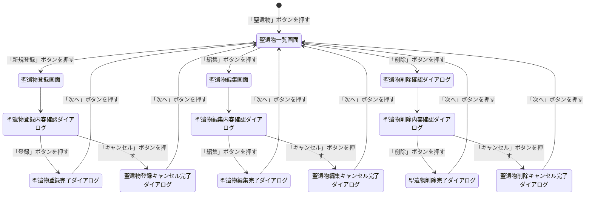
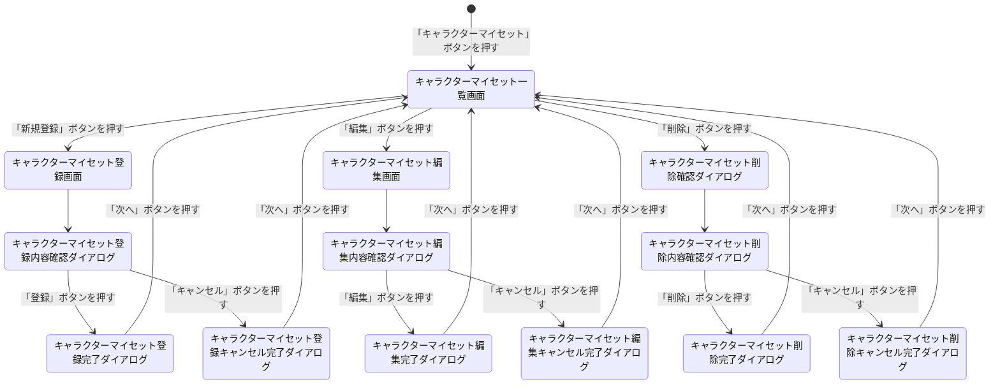
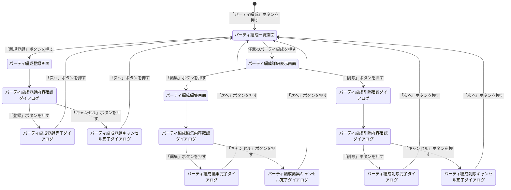
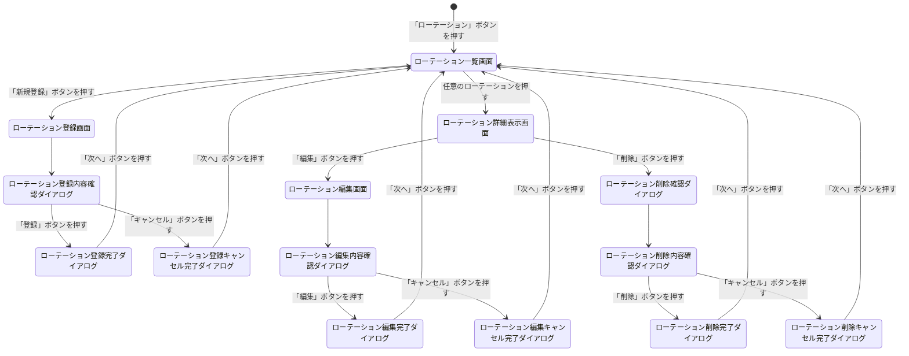
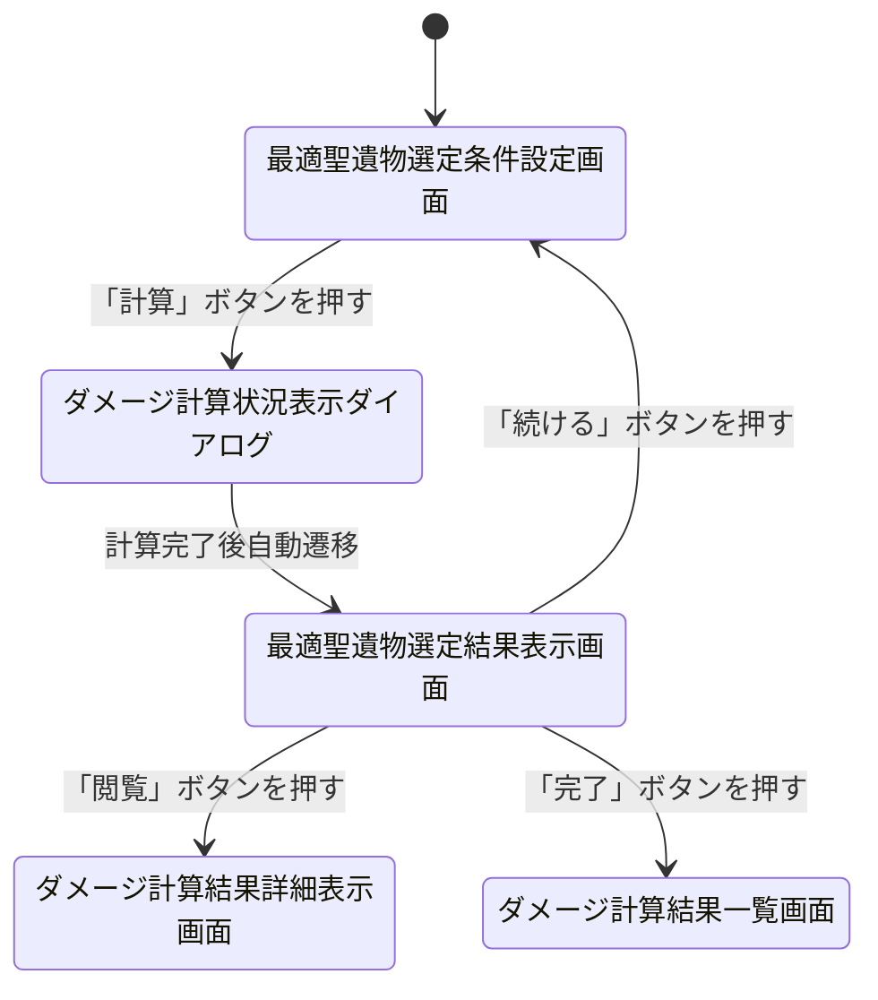
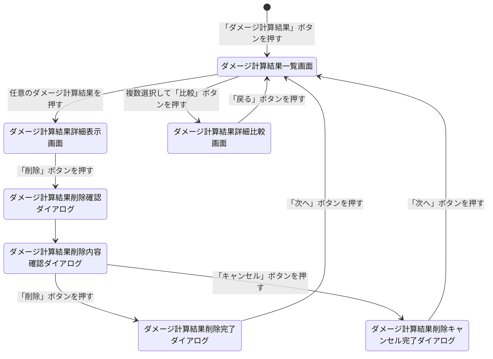

# GenshinDesktopApp

## 要件定義

### 目的

- 原神の所持聖遺物の中から 1 ローテーションの総ダメージが最大となるような聖遺物を選定する

### ユーザができること

- 所持している聖遺物データの自動取り込み
- 最適聖遺物セット選出
- 条件を変えて複数の構成でのダメージを比較
- GUI で操作
- 結果の保存と再読み込み

### 機能要件

| ID   | 機能                   | 内容                                                                     |
| ---- | ---------------------- | ------------------------------------------------------------------------ |
| F-01 | 聖遺物データの読み込み | 外部ファイル（例：JSON）から所持聖遺物情報を自動取り込み                 |
| F-02 | キャラクター選択       | 使用キャラクターを一覧から選択可能にする                                 |
| F-03 | 最適聖遺物の自動選定   | ダメージ計算に基づいて、対象キャラクターに最適な聖遺物セットを自動で決定 |
| F-04 | ダメージ計算           | 聖遺物とキャラクター情報に基づいて、想定ダメージを計算                   |
| F-05 | パーティ構成管理       | 複数キャラクターを組み合わせたパーティの構成を管理・保存                 |
| F-06 | 比較機能               | 条件を変えた構成間でのダメージを比較                                     |
| F-07 | 結果の保存・読み込み   | 計算結果や構成情報を保存し、後から読み込み可能                           |
| F-08 | GUI による操作         | Swing ベースのユーザーインターフェースで、視覚的に操作できるようにする   |

### 非機能要件

| ID   | 要件             | 内容                                                                                                                                             |
| ---- | ---------------- | ------------------------------------------------------------------------------------------------------------------------------------------------ |
| N-01 | 使用技術         | Java（JDK 17 以降推奨）、Swing、Maven を使用                                                                                                     |
| N-02 | 対応 OS          | Windows 10 / 11（他 OS は検証対象外）                                                                                                            |
| N-03 | 処理進捗の可視化 | ダメージ計算や聖遺物選定など処理に時間がかかる場合は、進捗バーや「残り時間の目安」などを画面上に表示してユーザーが待機時間を把握できるようにする |
| N-04 | データ形式       | 入出力ファイル形式は JSON を使用                                                                                                                 |
| N-05 | 保守性           | クラス・処理をモジュール単位に分離して保守性を高める                                                                                             |
| N-06 | UI 要件          | わかりやすく直感的な画面構成（ラベル・ボタン明示など）                                                                                           |
| N-07 | ログ出力         | 処理エラーや読み込み失敗時はログファイルに出力                                                                                                   |

### 保存対象の内容

基本的な保存形式は JSON 構造とする

#### 聖遺物構成

- 聖遺物部位（花・羽・時計・杯・冠）
- メインステータス（1 つ）
- サブステータス（最大 4 つ）
- 聖遺物セット名（例：剣闘士＋旧貴族など）
- 聖遺物レベル
- 聖遺物レアリティ
- スコアや評価値（例：会心率 ×2 ＋会心ダメ）

#### キャラクター構成

- キャラクター名
- レベル
- 突破レベル
- 命ノ星座の解放段階（0 ～ 6）
- 天賦レベル（通常、スキル、爆発）
- 武器
  - レベル
  - 突破レベル
  - 精錬ランク

#### パーティ構成

- パーティ名（任意の識別名）
- 選択キャラクター（最大 4 人）
- ロール（火力枠、バフ枠）
- 元素共鳴

#### ローテーション構成

- パーティ構成（パーティ構成参照）
- 行動順序の記録（例：ベネットスキル → 爆発 → 香菱スキル → 爆発 → 胡桃重撃など）
- 各行動のタイミング（UI 入力時は秒単位、処理はフレーム単位）
- ローテーション全体の時間（UI 入力時は秒単位、処理はフレーム単位）

#### シミュレーション構成

- ローテーション構成（ローテーション構成参照）
- 指定したキャラクター
- 最適化された聖遺物
- 敵のレベル・元素耐性
- バフ・デバフの有効／無効の切り替え（後日実装予定）
- キャラごとの総ダメージ（平均ダメージ・会心ダメージ・非会心ダメージの 3 種類）
- パーティ総ダメージ（平均ダメージ・会心ダメージ・非会心ダメージの 3 種類）
- キャラごとのダメージ割合（貢献率）
- ローテーション 1 周にかかる時間
- 経過時間当たりのダメージ分布（アクションごとに紐づけて管理）

## システム設計

### 外部設計

#### システム構成一覧

- 聖遺物管理システム
- 最適聖遺物選定システム

#### モジュール一覧

- 聖遺物管理モジュール

  - 聖遺物登録モジュール
  - 聖遺物編集モジュール
  - 聖遺物削除モジュール
  - 聖遺物一覧表示モジュール
  - 聖遺物検索・フィルタ・ソートモジュール

- キャラクターマイセット管理モジュール

  - キャラクターマイセット編集モジュール
  - キャラクター選択モジュール
  - キャラクターレベル選択モジュール
  - 天賦レベル選択モジュール
  - 命ノ星座選択モジュール
  - 武器選択モジュール
  - 精錬ランク選択モジュール
  - 聖遺物セット効果選択モジュール
  - キャラクターマイセット削除モジュール
  - キャラクターマイセット一覧表示モジュール
  - キャラクターマイセット検索・フィルタ・ソートモジュール

- パーティ編成管理モジュール

  - パーティ編成編集モジュール
  - パーティ編成登録モジュール
  - パーティ編成削除モジュール
  - パーティ編成一覧表示モジュール
  - パーティ編成検索・フィルタ・ソートモジュール

- ローテーション管理モジュール

  - パーティ編成選択モジュール
  - ローテーション編集モジュール
  - ローテーション登録モジュール
  - ローテーション複製モジュール
  - ローテーション削除モジュール
  - ローテーション一覧表示モジュール
  - ローテーション検索・フィルタ・ソートモジュール
  - ローテーション詳細表示モジュール

- 最適聖遺物選定モジュール
  - ローテーション選択モジュール
  - 対象キャラクター選択モジュール
  - 仮想敵レベル選択モジュール
  - 仮想敵耐性選択モジュール
  - ダメージ計算モジュール
  - ダメージ計算結果比較モジュール
  - 最大ダメージ計算結果保存モジュール
  - ダメージ計算結果削除モジュール
  - ダメージ計算結果一覧表示モジュール
  - ダメージ計算結果検索・フィルタ・ソートモジュール

#### 画面・ダイアログ一覧

- 聖遺物管理システム

  - 聖遺物一覧画面
  - 聖遺物登録画面
  - 聖遺物編集画面
  - 聖遺物登録内容確認ダイアログ
  - 聖遺物登録完了ダイアログ
  - 聖遺物登録キャンセル完了ダイアログ
  - 聖遺物編集内容確認ダイアログ
  - 聖遺物編集完了ダイアログ
  - 聖遺物編集キャンセル完了ダイアログ
  - 聖遺物削除確認ダイアログ
  - 聖遺物削除内容確認ダイアログ
  - 聖遺物削除完了ダイアログ
  - 聖遺物削除キャンセル完了ダイアログ

- キャラクターマイセット管理システム

  - キャラクターマイセット一覧画面
  - キャラクターマイセット登録画面
  - キャラクターマイセット編集画面
  - キャラクターマイセット登録内容確認ダイアログ
  - キャラクターマイセット登録完了ダイアログ
  - キャラクターマイセット登録キャンセル完了ダイアログ
  - キャラクターマイセット編集内容確認ダイアログ
  - キャラクターマイセット編集完了ダイアログ
  - キャラクターマイセット編集キャンセル完了ダイアログ
  - キャラクターマイセット削除確認ダイアログ
  - キャラクターマイセット削除内容確認ダイアログ
  - キャラクターマイセット削除完了ダイアログ
  - キャラクターマイセット削除キャンセル完了ダイアログ

- パーティ編成管理システム

  - パーティ編成一覧画面
  - パーティ編成登録画面
  - パーティ編成詳細表示画面
  - パーティ編成編集画面
  - パーティ編成登録内容確認ダイアログ
  - パーティ編成登録完了ダイアログ
  - パーティ編成登録キャンセル完了ダイアログ
  - パーティ編成編集内容確認ダイアログ
  - パーティ編成編集完了ダイアログ
  - パーティ編成編集キャンセル完了ダイアログ
  - パーティ編成削除確認ダイアログ
  - パーティ編成削除内容確認ダイアログ
  - パーティ編成削除完了ダイアログ
  - パーティ編成削除キャンセル完了ダイアログ

- ローテーション管理システム

  - ローテーション一覧画面
  - ローテーション登録画面
  - ローテーション詳細表示画面
  - ローテーション編集画面
  - ローテーション登録内容確認ダイアログ
  - ローテーション登録完了ダイアログ
  - ローテーション登録キャンセル完了ダイアログ
  - ローテーション編集内容確認ダイアログ
  - ローテーション編集完了ダイアログ
  - ローテーション編集キャンセル完了ダイアログ
  - ローテーション削除確認ダイアログ
  - ローテーション削除内容確認ダイアログ
  - ローテーション削除完了ダイアログ
  - ローテーション削除キャンセル完了ダイアログ

- 最適聖遺物選定システム

  - 最適聖遺物選定条件設定画面
  - 最適聖遺物選定結果表示画面
  - ダメージ計算結果詳細表示画面
  - ダメージ計算結果一覧画面
  - ダメージ計算状況表示ダイアログ

- ダメージ計算結果管理システム
  - ダメージ計算結果一覧画面
  - ダメージ計算結果詳細表示画面
  - ダメージ計算結果詳細比較画面
  - ダメージ計算結果削除確認ダイアログ
  - ダメージ計算結果削除内容確認ダイアログ
  - ダメージ計算結果削除完了ダイアログ
  - ダメージ計算結果削除キャンセル完了ダイアログ

#### 画面遷移図

- 聖遺物管理システム

---

- キャラクターマイセット管理システム

---

- パーティ編成管理システム

---

- ローテーション管理システム

---

- 最適聖遺物選定システム

---

- ダメージ計算結果管理システム

### 内部設計

#### 入出力仕様（型に関してはあとで詰める）

<!-- ここから始める。テンプレートだけ置いておく -->

聖遺物登録・編集モジュール

- 入力項目

| 項目名   | 型     | 必須 | 制約                          | 説明               |
| -------- | ------ | ---- | ----------------------------- | ------------------ |
| id       | String | ○    | UUID 形式                     | 一意な ID          |
| setName  | String | ○    |                               | 聖遺物のセット名   |
| type     | String | ○    |                               | 聖遺物の部位       |
| mainStat | String | ○    | type によって選択肢条件あり   | メインオプション   |
| subStats | String | ○    | 4 つかつ重複不可              | サブオプション     |
| rarity   | String | ○    |                               | レア度             |
| level    | String | ○    | rarity によって選択肢条件あり | 聖遺物のレベル     |
| score    | String | ○    |                               | 聖遺物の会心スコア |

- 出力項目

| 項目名   | 型     | 説明                           |
| -------- | ------ | ------------------------------ |
| status   | String | "success" または "error"       |
| message  | String | status に応じたメッセージ      |
| setName  | String | 聖遺物登録内容確認ダイアログ用 |
| type     | String | 聖遺物登録内容確認ダイアログ用 |
| mainStat | String | 聖遺物登録内容確認ダイアログ用 |
| subStats | String | 聖遺物登録内容確認ダイアログ用 |
| rarity   | String | 聖遺物登録内容確認ダイアログ用 |
| level    | String | 聖遺物登録内容確認ダイアログ用 |

キャラクターマイセット登録・編集モジュール

- 入力項目

| 項目名             | 型     | 必須 | 制約      | 説明                       |
| ------------------ | ------ | ---- | --------- | -------------------------- |
| id                 | String | ○    | UUID 形式 | 一意な ID                  |
| character          | String | ○    |           | キャラクター               |
| characterLevel     | String | ○    | 1-90      | キャラクターのレベル       |
| characterAscension | String | ○    | 0-6       | キャラクターの突破段階     |
| talentLevels       | String | ○    | 1-10      | キャラクターの各天賦レベル |
| constellation      | String | ○    | 0-6       | キャラクターの命の星座     |
| weapon             | String | ○    |           | キャラクターの武器         |
| weaponLevel        | String | ○    | 1-90      | 武器のレベル               |
| weaponAscension    | String | ○    | 0-6       | 武器の突破段階             |
| refinement         | String | ○    | 1-5       | 精錬ランク                 |

- 出力項目

| 項目名             | 型     | 説明                                           |
| ------------------ | ------ | ---------------------------------------------- |
| status             | String | "success" または "error"                       |
| message            | String | status に応じたメッセージ                      |
| character          | String | キャラクターマイセット登録内容確認ダイアログ用 |
| characterLevel     | String | キャラクターマイセット登録内容確認ダイアログ用 |
| characterAscension | String | キャラクターマイセット登録内容確認ダイアログ用 |
| talentLevels       | String | キャラクターマイセット登録内容確認ダイアログ用 |
| constellation      | String | キャラクターマイセット登録内容確認ダイアログ用 |
| weapon             | String | キャラクターマイセット登録内容確認ダイアログ用 |
| weaponLevel        | String | キャラクターマイセット登録内容確認ダイアログ用 |
| weaponAscension    | String | キャラクターマイセット登録内容確認ダイアログ用 |
| refinement         | String | キャラクターマイセット登録内容確認ダイアログ用 |

パーティ編成登録・編集モジュール

- 入力項目

| 項目名     | 型     | 必須 | 制約               | 説明                 |
| ---------- | ------ | ---- | ------------------ | -------------------- |
| id         | String | ○    | UUID 形式          | 一意な ID            |
| name       | String | ○    |                    | パーティ名           |
| characters | String | ○    | 1-4 人かつ重複不可 | 編成するキャラクター |
| roles      | String | ○    | 火力枠またはバフ枠 | パーティでの役割     |

- 出力項目

| 項目名     | 型     | 説明                                 |
| ---------- | ------ | ------------------------------------ |
| status     | String | "success" または "error"             |
| message    | String | status に応じたメッセージ            |
| name       | String | パーティ編成登録内容確認ダイアログ用 |
| characters | String | パーティ編成登録内容確認ダイアログ用 |
| roles      | String | パーティ編成登録内容確認ダイアログ用 |

ローテーション登録・編集モジュール

- 入力項目

| 項目名  | 型     | 必須 | 制約      | 説明                       |
| ------- | ------ | ---- | --------- | -------------------------- |
| id      | String | ○    | UUID 形式 | 一意な ID                  |
| party   | String | ○    |           | 選択したパーティ編成       |
| actions | String | ○    |           | スキルローテーションを記述 |

- 出力項目

| 項目名  | 型     | 説明                                   |
| ------- | ------ | -------------------------------------- |
| status  | String | "success" または "error"               |
| message | String | status に応じたメッセージ              |
| party   | String | ローテーション登録内容確認ダイアログ用 |
| actions | String | ローテーション登録内容確認ダイアログ用 |

#### 処理フロー設計

#### エラーメッセージ・エラーコード一覧

#### バリデーション設計

#### 状態遷移・フラグ管理

計算中の表示をするためのフラグを管理するため
聖遺物インポート中に登録ボタンを押せなくするとか

#### ユースケース設計

ユーザが行う行動（選択ボタンを押すとか）のときにのどのメソッドが呼ばれるのか
メソッドとユーザの行動を紐づける

#### 非同期処理設計

プログレスバーを表示するため

### プログラム設計

#### 画面に関するメモ

- ホーム画面は各システムへのくそデカボタンを配置する
- 聖遺物のインポート中やダメージ計算中には進行状況がわかるようにしたい

### クラス

#### 設計図クラス

| CharacterDefinition |
| ------------------- |
|                     |
|                     |

| CharacterActionDefinition |
| ------------------------- |
|                           |
|                           |

| ActionDefinition |
| ---------------- |
|                  |
|                  |

| WeaponDefinition |
| ---------------- |
|                  |
|                  |

| ArtifactDefinition |
| ------------------ |
|                    |
|                    |

| BuffDefinition |
| -------------- |
|                |
|                |

| StatType |
| -------- |
|          |
|          |

| StatSource |
| ---------- |
|            |
|            |

#### 実装クラス

| CharacterInstance |
| ----------------- |
|                   |
|                   |

| WeaponInstance |
| -------------- |
|                |
|                |

| ArtifactInstance |
| ---------------- |
|                  |
|                  |

| BuffInstance |
| ------------ |
|              |
|              |

| StatInstance |
| ------------ |
|              |
|              |

| PartyInstance |
| ------------- |
|               |
|               |

| RotationInstance |
| ---------------- |
|                  |
|                  |

| DamageCalculator |
| ---------------- |
|                  |
|                  |

| OptimizationEngine |
| ------------------ |
|                    |
|                    |

| ResultSnapshot |
| -------------- |
|                |
|                |

## テーブルテンプレート

|     |     |     |
| --- | --- | --- |
|     |     |     |

- 聖遺物管理モジュール

