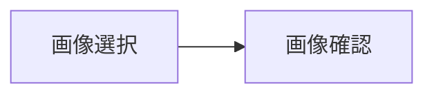

# GenshinDesktopApp

## 要件定義

### 目的

- 原神の所持聖遺物の中から 1 ローテーションの総ダメージが最大となるような聖遺物を選定する

### ユーザができること

- 所持している聖遺物データの自動取り込み
- 最適聖遺物セット選出
- 条件を変えて複数の構成でのダメージを比較
- GUI で操作
- 結果の保存と再読み込み

### 機能要件

| ID   | 機能                   | 内容                                                                     |
| ---- | ---------------------- | ------------------------------------------------------------------------ |
| F-01 | 聖遺物データの読み込み | 外部ファイル（例：JSON）から所持聖遺物情報を自動取り込み                 |
| F-02 | キャラクター選択       | 使用キャラクターを一覧から選択可能にする                                 |
| F-03 | 最適聖遺物の自動選定   | ダメージ計算に基づいて、対象キャラクターに最適な聖遺物セットを自動で決定 |
| F-04 | ダメージ計算           | 聖遺物とキャラクター情報に基づいて、想定ダメージを計算                   |
| F-05 | パーティ構成管理       | 複数キャラクターを組み合わせたパーティの構成を管理・保存                 |
| F-06 | 比較機能               | 条件を変えた構成間でのダメージを比較                                     |
| F-07 | 結果の保存・読み込み   | 計算結果や構成情報を保存し、後から読み込み可能                           |
| F-08 | GUI による操作         | Swing ベースのユーザーインターフェースで、視覚的に操作できるようにする   |

### 非機能要件

| ID   | 要件             | 内容                                                                                                                                             |
| ---- | ---------------- | ------------------------------------------------------------------------------------------------------------------------------------------------ |
| N-01 | 使用技術         | Java（JDK 17 以降推奨）、Swing、Maven を使用                                                                                                     |
| N-02 | 対応 OS          | Windows 10 / 11（他 OS は検証対象外）                                                                                                            |
| N-03 | 処理進捗の可視化 | ダメージ計算や聖遺物選定など処理に時間がかかる場合は、進捗バーや「残り時間の目安」などを画面上に表示してユーザーが待機時間を把握できるようにする |
| N-04 | データ形式       | 入出力ファイル形式は JSON を使用                                                                                                                 |
| N-05 | 保守性           | クラス・処理をモジュール単位に分離して保守性を高める                                                                                             |
| N-06 | UI 要件          | わかりやすく直感的な画面構成（ラベル・ボタン明示など）                                                                                           |
| N-07 | ログ出力         | 処理エラーや読み込み失敗時はログファイルに出力                                                                                                   |

### 保存対象の内容

基本的な保存形式は JSON 構造とする

#### 聖遺物構成

- 聖遺物部位（花・羽・時計・杯・冠）
- メインステータス（1 つ）
- サブステータス（最大 4 つ）
- 聖遺物セット名（例：剣闘士＋旧貴族など）
- 聖遺物レベル
- 聖遺物レアリティ
- スコアや評価値（例：会心率 ×2 ＋会心ダメ）

#### キャラクター構成

- キャラクター名
- レベル
- 突破レベル
- 命ノ星座の解放段階（0 ～ 6）
- 天賦レベル（通常、スキル、爆発）
- 武器
  - レベル
  - 突破レベル
  - 精錬ランク

#### パーティ構成

- パーティ名（任意の識別名）
- 選択キャラクター（最大 4 人）
- ロール（火力枠、バフ枠）
- 元素共鳴

#### ローテーション構成

- パーティ構成（パーティ構成参照）
- 行動順序の記録（例：ベネットスキル → 爆発 → 香菱スキル → 爆発 → 胡桃重撃など）
- 各行動のタイミング（UI 入力時は秒単位、処理はフレーム単位）
- ローテーション全体の時間（UI 入力時は秒単位、処理はフレーム単位）

#### シミュレーション構成

- ローテーション構成（ローテーション構成参照）
- 指定したキャラクター
- 最適化された聖遺物
- 敵のレベル・元素耐性
- バフ・デバフの有効／無効の切り替え（後日実装予定）
- キャラごとの総ダメージ（平均ダメージ・会心ダメージ・非会心ダメージの 3 種類）
- パーティ総ダメージ（平均ダメージ・会心ダメージ・非会心ダメージの 3 種類）
- キャラごとのダメージ割合（貢献率）
- ローテーション 1 周にかかる時間
- 経過時間当たりのダメージ分布（アクションごとに紐づけて管理）

## システム設計

### 外部設計

#### システム一覧

- 聖遺物管理システム
- キャラクターマイセット管理システム
- パーティ編成管理システム
- ローテーション管理システム
- 最適聖遺物選定システム
- ダメージ計算結果管理システム
- マスターデータ管理システム（あとでやる）

#### モジュール一覧

聖遺物管理システム

- 聖遺物登録モジュール
- 聖遺物編集モジュール
- 聖遺物削除モジュール
- 聖遺物一覧表示モジュール
- 聖遺物検索・フィルタ・ソートモジュール

キャラクターマイセット管理システム

- キャラクターマイセット編集モジュール
- キャラクター選択モジュール
- キャラクターレベル選択モジュール
- 天賦レベル選択モジュール
- 命ノ星座選択モジュール
- 武器選択モジュール
- 精錬ランク選択モジュール
- 聖遺物セット効果選択モジュール
- キャラクターマイセット削除モジュール
- キャラクターマイセット一覧表示モジュール
- キャラクターマイセット検索・フィルタ・ソートモジュール

パーティ編成管理システム

- パーティ編成編集モジュール
- パーティ編成登録モジュール
- パーティ編成削除モジュール
- パーティ編成一覧表示モジュール
- パーティ編成検索・フィルタ・ソートモジュール

ローテーション管理システム

- パーティ編成選択モジュール
- ローテーション編集モジュール
- ローテーション登録モジュール
- ローテーション複製モジュール
- ローテーション削除モジュール
- ローテーション一覧表示モジュール
- ローテーション検索・フィルタ・ソートモジュール
- ローテーション詳細表示モジュール

最適聖遺物選定システム

- ローテーション選択モジュール
- 対象キャラクター選択モジュール
- 仮想敵レベル選択モジュール
- 仮想敵耐性選択モジュール
- ダメージ計算モジュール

ダメージ計算結果管理システム

- ダメージ計算結果比較モジュール
- 最大ダメージ計算結果保存モジュール
- ダメージ計算結果削除モジュール
- ダメージ計算結果一覧表示モジュール
- ダメージ計算結果検索・フィルタ・ソートモジュール

#### 画面・ダイアログ一覧

聖遺物管理システム

- 聖遺物一覧画面
- 聖遺物登録画面
- 聖遺物編集画面
- 聖遺物登録内容確認ダイアログ
- 聖遺物登録完了ダイアログ
- 聖遺物登録キャンセル完了ダイアログ
- 聖遺物編集内容確認ダイアログ
- 聖遺物編集完了ダイアログ
- 聖遺物編集キャンセル完了ダイアログ
- 聖遺物削除確認ダイアログ
- 聖遺物削除内容確認ダイアログ
- 聖遺物削除完了ダイアログ
- 聖遺物削除キャンセル完了ダイアログ

キャラクターマイセット管理システム

- キャラクターマイセット一覧画面
- キャラクターマイセット登録画面
- キャラクターマイセット編集画面
- キャラクターマイセット登録内容確認ダイアログ
- キャラクターマイセット登録完了ダイアログ
- キャラクターマイセット登録キャンセル完了ダイアログ
- キャラクターマイセット編集内容確認ダイアログ
- キャラクターマイセット編集完了ダイアログ
- キャラクターマイセット編集キャンセル完了ダイアログ
- キャラクターマイセット削除確認ダイアログ
- キャラクターマイセット削除内容確認ダイアログ
- キャラクターマイセット削除完了ダイアログ
- キャラクターマイセット削除キャンセル完了ダイアログ

パーティ編成管理システム

- パーティ編成一覧画面
- パーティ編成登録画面
- パーティ編成詳細表示画面
- パーティ編成編集画面
- パーティ編成登録内容確認ダイアログ
- パーティ編成登録完了ダイアログ
- パーティ編成登録キャンセル完了ダイアログ
- パーティ編成編集内容確認ダイアログ
- パーティ編成編集完了ダイアログ
- パーティ編成編集キャンセル完了ダイアログ
- パーティ編成削除確認ダイアログ
- パーティ編成削除内容確認ダイアログ
- パーティ編成削除完了ダイアログ
- パーティ編成削除キャンセル完了ダイアログ

ローテーション管理システム

- ローテーション一覧画面
- ローテーション登録画面
- ローテーション詳細表示画面
- ローテーション編集画面
- ローテーション登録内容確認ダイアログ
- ローテーション登録完了ダイアログ
- ローテーション登録キャンセル完了ダイアログ
- ローテーション編集内容確認ダイアログ
- ローテーション編集完了ダイアログ
- ローテーション編集キャンセル完了ダイアログ
- ローテーション削除確認ダイアログ
- ローテーション削除内容確認ダイアログ
- ローテーション削除完了ダイアログ
- ローテーション削除キャンセル完了ダイアログ

最適聖遺物選定システム

- 最適聖遺物選定条件設定画面
- 最適聖遺物選定結果表示画面
- ダメージ計算結果詳細表示画面
- ダメージ計算結果一覧画面
- ダメージ計算状況表示ダイアログ

ダメージ計算結果管理システム

- ダメージ計算結果一覧画面
- ダメージ計算結果詳細表示画面
- ダメージ計算結果詳細比較画面
- ダメージ計算結果削除確認ダイアログ
- ダメージ計算結果削除内容確認ダイアログ
- ダメージ計算結果削除完了ダイアログ
- ダメージ計算結果削除キャンセル完了ダイアログ

#### 画面遷移図

聖遺物管理システム

---

キャラクターマイセット管理システム

---

パーティ編成管理システム

---

ローテーション管理システム

---

最適聖遺物選定システム

---

ダメージ計算結果管理システム

### 内部設計

#### 機能一覧

聖遺物管理システム

- 一覧表示機能
- 検索・フィルタ・ソート機能
- ゲーム内画像登録機能
- インポートファイル登録機能
- 抽出進行状況表示機能
- 登録結果表示機能
- 登録内容表示機能
- 登録完了表示機能
- 詳細表示機能
- 更新内容表示機能
- 更新完了表示機能
- 削除内容表示機能
- 削除完了表示機能

キャラクターマイセット管理システム

- 一覧表示機能
- 検索・フィルタ・ソート機能
- 手動登録機能
- インポートファイル登録機能
- 抽出進行状況表示機能
- 登録結果表示機能
- 登録内容表示機能
- 登録完了表示機能
- 詳細表示機能
- 更新内容表示機能
- 更新完了表示機能
- 削除内容表示機能
- 削除完了表示機能

パーティ編成管理システム

- 一覧表示機能
- 検索・フィルタ・ソート機能
- 手動登録機能
- インポートファイル登録機能
- 抽出進行状況表示機能
- 登録結果表示機能
- 登録内容表示機能
- 登録完了表示機能
- 詳細表示機能
- 更新内容表示機能
- 更新完了表示機能
- 削除内容表示機能
- 削除完了表示機能

ローテーション管理システム

- 一覧表示機能
- 検索・フィルタ・ソート機能
- 手動登録機能
- インポートファイル登録機能
- 抽出進行状況表示機能
- 登録結果表示機能
- 登録内容表示機能
- 登録完了表示機能
- 詳細表示機能
- 更新内容表示機能
- 更新完了表示機能
- 削除内容表示機能
- 削除完了表示機能

最適聖遺物選定システム

- 条件設定機能
- 選定進行状況表示機能
- 選定完了表示機能
- 選定結果表示機能

ダメージ計算結果管理システム

- 一覧表示機能
- 検索・フィルタ・ソート機能
- 手動登録機能
- インポートファイル登録機能
- 抽出進行状況表示機能
- 登録結果表示機能
- 登録内容表示機能
- 登録完了表示機能
- 詳細表示機能
- 更新内容表示機能
- 更新完了表示機能
- 削除内容表示機能
- 削除完了表示機能

#### 入出力仕様

聖遺物登録・編集モジュール

- 入力項目

| 項目名   | 型             | 必須 | Enum | 制約                          | 説明               |
| -------- | -------------- | ---- | ---- | ----------------------------- | ------------------ |
| id       | `UUID`         | ✅   | ⬜   |                               | 一意な ID          |
| set      | `ArtifactSet`  | ✅   | ⬜   |                               | 聖遺物のセット     |
| type     | `ArtifactType` | ✅   | ✅   |                               | 聖遺物の部位       |
| mainStat | `Stat`         | ✅   | ✅   | type によって選択肢条件あり   | メインオプション   |
| subStats | `List<Stat>`   | ✅   | ⬜   | 4 つかつ重複不可              | サブオプション     |
| rarity   | `Int`          | ✅   | ⬜   |                               | レア度             |
| level    | `Int`          | ✅   | ⬜   | rarity によって選択肢条件あり | 聖遺物のレベル     |
| score    | `Double`       | ✅   | ⬜   |                               | 聖遺物の会心スコア |

- 出力項目

| 項目名   | 型             | 必須 | Enum | 制約                     | 説明                           |
| -------- | -------------- | ---- | ---- | ------------------------ | ------------------------------ |
| status   | `StatusType`   | ✅   | ✅   | `success` または `error` | 処理結果のステータス           |
| message  | `String`       | ✅   | ⬜   |                          | status に応じたメッセージ      |
| set      | `ArtifactSet`  | ⬜   | ⬜   |                          | 聖遺物登録内容確認ダイアログ用 |
| type     | `ArtifactType` | ⬜   | ✅   |                          | 聖遺物登録内容確認ダイアログ用 |
| mainStat | `Stat`         | ⬜   | ✅   |                          | 聖遺物登録内容確認ダイアログ用 |
| subStats | `List<Stat>`   | ⬜   | ⬜   |                          | 聖遺物登録内容確認ダイアログ用 |
| rarity   | `Int`          | ⬜   | ⬜   |                          | 聖遺物登録内容確認ダイアログ用 |
| level    | `Int`          | ⬜   | ⬜   |                          | 聖遺物登録内容確認ダイアログ用 |
| score    | `Double`       | ⬜   | ⬜   |                          | 聖遺物登録内容確認ダイアログ用 |

キャラクターマイセット登録・編集モジュール

- 入力項目

| 項目名             | 型          | 必須 | Enum | 制約 | 説明                       |
| ------------------ | ----------- | ---- | ---- | ---- | -------------------------- |
| id                 | `UUID`      | ✅   | ⬜   |      | 一意な ID                  |
| character          | `Character` | ✅   | ⬜   |      | キャラクター               |
| characterLevel     | `Int`       | ✅   | ⬜   | 1-90 | キャラクターのレベル       |
| characterAscension | `Int`       | ✅   | ⬜   | 0-6  | キャラクターの突破段階     |
| talentLevels       | `List<Int>` | ✅   | ⬜   | 1-10 | キャラクターの各天賦レベル |
| constellation      | `Int`       | ✅   | ⬜   | 0-6  | キャラクターの命の星座     |
| weapon             | `Weapon`    | ✅   | ⬜   |      | キャラクターの武器         |
| weaponLevel        | `Int`       | ✅   | ⬜   | 1-90 | 武器のレベル               |
| weaponAscension    | `Int`       | ✅   | ⬜   | 0-6  | 武器の突破段階             |
| refinement         | `Int`       | ✅   | ⬜   | 1-5  | 精錬ランク                 |

- 出力項目

| 項目名             | 型           | 必須 | Enum | 制約                     | 説明                                           |
| ------------------ | ------------ | ---- | ---- | ------------------------ | ---------------------------------------------- |
| status             | `StatusType` | ✅   | ✅   | `success` または `error` | 処理結果のステータス                           |
| message            | `String`     | ✅   | ⬜   |                          | status に応じたメッセージ                      |
| character          | `Character`  | ⬜   | ⬜   |                          | キャラクターマイセット登録内容確認ダイアログ用 |
| characterLevel     | `Int`        | ⬜   | ⬜   |                          | キャラクターマイセット登録内容確認ダイアログ用 |
| characterAscension | `Int`        | ⬜   | ⬜   |                          | キャラクターマイセット登録内容確認ダイアログ用 |
| talentLevels       | `List<Int>`  | ⬜   | ⬜   |                          | キャラクターマイセット登録内容確認ダイアログ用 |
| constellation      | `Int`        | ⬜   | ⬜   |                          | キャラクターマイセット登録内容確認ダイアログ用 |
| weapon             | `Weapon`     | ⬜   | ⬜   |                          | キャラクターマイセット登録内容確認ダイアログ用 |
| weaponLevel        | `Int`        | ⬜   | ⬜   |                          | キャラクターマイセット登録内容確認ダイアログ用 |
| weaponAscension    | `Int`        | ⬜   | ⬜   |                          | キャラクターマイセット登録内容確認ダイアログ用 |
| refinement         | `Int`        | ⬜   | ⬜   |                          | キャラクターマイセット登録内容確認ダイアログ用 |

パーティ編成登録・編集モジュール

- 入力項目

| 項目名     | 型                     | 必須 | Enum | 制約               | 説明                 |
| ---------- | ---------------------- | ---- | ---- | ------------------ | -------------------- |
| id         | `UUID`                 | ✅   | ⬜   |                    | 一意な ID            |
| name       | `String`               | ✅   | ⬜   |                    | パーティ名           |
| characters | `List<CharacterMySet>` | ✅   | ⬜   | 1-4 人かつ重複不可 | 編成するキャラクター |
| roles      | `List<Role>`           | ✅   | ✅   | 火力枠またはバフ枠 | パーティでの役割     |

- 出力項目

| 項目名             | 型                         | 必須 | Enum | 制約                     | 説明                                 |
| ------------------ | -------------------------- | ---- | ---- | ------------------------ | ------------------------------------ |
| status             | `StatusType`               | ✅   | ✅   | `success` または `error` | 処理結果のステータス                 |
| message            | `String`                   | ✅   | ⬜   |                          | status に応じたメッセージ            |
| name               | `String`                   | ⬜   | ⬜   |                          | パーティ編成登録内容確認ダイアログ用 |
| characters         | `List<CharacterMySet>`     | ⬜   | ⬜   |                          | パーティ編成登録内容確認ダイアログ用 |
| roles              | `List<Role>`               | ⬜   | ✅   |                          | パーティ編成登録内容確認ダイアログ用 |
| elementalResonance | `List<ElementalResonance>` | ⬜   | ✅   |                          | パーティ編成登録内容確認ダイアログ用 |

ローテーション登録・編集モジュール

- 入力項目

| 項目名  | 型             | 必須 | Enum | 制約 | 説明                       |
| ------- | -------------- | ---- | ---- | ---- | -------------------------- |
| id      | `UUID`         | ✅   | ⬜   |      | 一意な ID                  |
| party   | `Party`        | ✅   | ⬜   |      | 選択したパーティ編成       |
| actions | `List<Action>` | ✅   | ⬜   |      | スキルローテーションを記述 |

- 出力項目

| 項目名  | 型             | 必須 | Enum | 制約                     | 説明                                   |
| ------- | -------------- | ---- | ---- | ------------------------ | -------------------------------------- |
| status  | `StatusType`   | ✅   | ✅   | `success` または `error` | 処理結果のステータス                   |
| message | `String`       | ✅   | ⬜   |                          | status に応じたメッセージ              |
| party   | `Party`        | ⬜   | ⬜   |                          | ローテーション登録内容確認ダイアログ用 |
| actions | `List<Action>` | ⬜   | ⬜   |                          | ローテーション登録内容確認ダイアログ用 |

最適聖遺物選定モジュール

- 入力項目

| 項目名           | 型                 | 必須 | Enum | 制約 | 説明                   |
| ---------------- | ------------------ | ---- | ---- | ---- | ---------------------- |
| id               | `UUID`             | ✅   | ⬜   |      | 一意な ID              |
| rotation         | `Rotation`         | ✅   | ⬜   |      | 選択したローテーション |
| character        | `Character`        | ✅   | ⬜   |      | 最適化するキャラクター |
| enemyLevel       | `Int`              | ✅   | ⬜   |      | 敵のレベル             |
| enemyResistances | `List<Resistance>` | ✅   | ⬜   |      | 敵の耐性               |

- 出力項目

| 項目名           | 型                 | 必須 | Enum | 制約                     | 説明                      |
| ---------------- | ------------------ | ---- | ---- | ------------------------ | ------------------------- |
| status           | `StatusType`       | ✅   | ✅   | `success` または `error` | 処理結果のステータス      |
| message          | `String`           | ✅   | ⬜   |                          | status に応じたメッセージ |
| rotation         | `Rotation`         | ⬜   | ⬜   |                          | 最適化内容確認画面用      |
| character        | `Character`        | ⬜   | ⬜   |                          | 最適化内容確認画面用      |
| enemyLevel       | `Int`              | ⬜   | ⬜   |                          | 最適化内容確認画面用      |
| enemyResistances | `List<Resistance>` | ⬜   | ⬜   |                          | 最適化内容確認画面用      |
| artifacts        | `List<Artifact>`   | ⬜   | ⬜   |                          | 最適化内容確認画面用      |

ダメージ計算結果詳細表示モジュール

- 入力項目

| 項目名           | 型                 | 必須 | Enum | 制約 | 説明                   |
| ---------------- | ------------------ | ---- | ---- | ---- | ---------------------- |
| id               | `UUID`             | ✅   | ⬜   |      | 一意な ID              |
| rotation         | `Rotation`         | ✅   | ⬜   |      | ローテーションを選択   |
| character        | `Character`        | ✅   | ⬜   |      | 最適化するキャラクター |
| enemyLevel       | `Int`              | ✅   | ⬜   |      | 敵のレベル             |
| enemyResistances | `List<Resistance>` | ✅   | ⬜   |      | 敵の耐性               |
| artifacts        | `List<Artifact>`   | ⬜   | ⬜   |      | 装備する聖遺物         |

- 出力項目

| 項目名            | 型                 | 必須 | Enum | 制約                     | 説明                           |
| ----------------- | ------------------ | ---- | ---- | ------------------------ | ------------------------------ |
| status            | `StatusType`       | ✅   | ✅   | `success` または `error` | 処理結果のステータス           |
| message           | `String`           | ✅   | ⬜   |                          | status に応じたメッセージ      |
| rotation          | `Rotation`         | ⬜   | ⬜   |                          | ダメージ計算結果詳細表示画面用 |
| character         | `Character`        | ⬜   | ⬜   |                          | ダメージ計算結果詳細表示画面用 |
| enemyLevel        | `Int`              | ⬜   | ⬜   |                          | ダメージ計算結果詳細表示画面用 |
| enemyResistances  | `List<Resistance>` | ⬜   | ⬜   |                          | ダメージ計算結果詳細表示画面用 |
| artifacts         | `List<Artifact>`   | ⬜   | ⬜   |                          | ダメージ計算結果詳細表示画面用 |
| totalDamage       | `Double`           | ⬜   | ⬜   |                          | ダメージ計算結果詳細表示画面用 |
| damagePerRotation | `Double`           | ⬜   | ⬜   |                          | ダメージ計算結果詳細表示画面用 |
| timePerRotation   | `Double`           | ⬜   | ⬜   |                          | ダメージ計算結果詳細表示画面用 |

ダメージ計算結果比較モジュール

- 入力項目

| 項目名      | 型                 | 必須 | Enum | 制約 | 説明               |
| ----------- | ------------------ | ---- | ---- | ---- | ------------------ |
| simulations | `List<Simulation>` | ✅   | ⬜   |      | 比較するものを選択 |

- 出力項目

| 項目名      | 型                 | 必須 | Enum | 制約                     | 説明                           |
| ----------- | ------------------ | ---- | ---- | ------------------------ | ------------------------------ |
| status      | `StatusType`       | ✅   | ✅   | `success` または `error` | 処理結果のステータス           |
| message     | `String`           | ✅   | ⬜   |                          | status に応じたメッセージ      |
| simulations | `List<Simulation>` | ✅   | ⬜   |                          | ダメージ計算結果詳細比較画面用 |

#### 処理フロー設計

表示機能

1. 聖遺物管理ファイルを開き、すべての聖遺物データを読み込む

2. 入力された検索条件が存在する場合

   - 条件に合致する聖遺物だけをフィルタリングする
   - （例：部位＝花、レアリティ＝ 5 の聖遺物だけ表示）

3. 入力されたソート条件が存在する場合

   - 指定されたフィールドを基準にデータを並び替える
   - （例：スコア順降順、レアリティ順昇順）

4. 表示用にデータ整形を行う

   - 表示に不要な内部データ（UUID など）を除外
   - 必要に応じて数値 → 文字列変換を行う（例：レアリティ 5→「★5」）

5. 整形された聖遺物リストを画面に出力する

   - ページング対応する場合は 1 ページ分だけ表示
   - 件数情報を表示（例：「全 100 件中 1〜20 件を表示中」）

6. エラー発生時
   - ファイル読み込みエラー、データ不整合エラーなどはユーザーにエラーメッセージを表示する

登録機能

1. 進行ダイアログを表示し、初期状態（0％）に設定する

2. 登録対象の聖遺物データリストを 1 件ずつ処理するループを開始

   **各聖遺物データごとに以下を実行：**

   - 必須項目チェック
     - すべての必須フィールドが存在するかを検証する
     - subStats の数が 4 つであること、かつ重複がないことを検証する
   - 型・制約チェック
     - type、mainStat が有効な Enum に一致するか検証する
     - level が rarity に応じた上限範囲内にあるかを検証する
   - 重複データチェック
     - id 以外の（set, type, mainStat, subStats, rarity, level, score）が既存データと完全一致するデータがないかを確認
     - 重複があればエラーとし、該当データはスキップする
   - ID 生成
     - 新たに UUID を発行して id 項目にセットする
   - 登録処理
     - 聖遺物管理ファイルにデータを追加保存する
   - 成功・失敗判定
     - 成功：進捗ダイアログに「登録成功」と表示
     - 失敗：エラー内容を記録してダイアログに「登録失敗」と表示
   - ダイアログ更新
     - 処理件数に応じて進行状況（％）を更新して表示する

3. 全データ処理完了後

   - 最終結果（成功件数、失敗件数、エラーリスト）をダイアログに表示
   - 完了メッセージを出す

4. ダイアログを閉じる

更新機能

1. 聖遺物管理ファイルを開き、すべての聖遺物データを読み込む

2. 入力された ID（UUID）で更新対象の聖遺物データを検索する

   - 見つからない場合はエラー終了（例：「指定 ID が存在しません」）

3. 更新後データに対してバリデーションチェックを行う

   - 必須項目が欠けていないか（更新後に不正な状態にならないか）
   - 型チェック・範囲チェック（例：レアリティ 1〜5、レベル上限チェック）
   - サブステの 4 件＆重複なしルールを満たしているか

4. （オプション）更新後のデータが「ID 以外すべて同じ」既存データと重複していないかチェック

   - 重複がある場合はエラーにする

5. 該当聖遺物のデータを更新する

   - 指定されたフィールドのみ書き換え
   - 未指定フィールドは元の値を維持

6. 更新後の聖遺物リストを聖遺物管理ファイルに保存し直す

7. 成功メッセージを返す

   - 更新完了通知をユーザーに表示する

8. エラー発生時
   - エラーコード＋エラーメッセージを返す

削除機能

1. 聖遺物管理ファイルを開き、すべての聖遺物データを読み込む

2. 入力された ID（UUID）で削除対象の聖遺物を検索する

   - 見つからない場合はエラー終了（例：「指定 ID が存在しません」）

3. 削除対象の聖遺物情報を画面に表示し、ユーザに確認ダイアログを表示する

   - メッセージ例：「この聖遺物を本当に削除しますか？」
   - ボタン：「はい」「キャンセル」

4. ユーザーが「はい」を選択した場合

   - リストから該当の聖遺物データを除去する
   - 削除後の聖遺物リストを聖遺物管理ファイルに保存する
   - 成功メッセージを返す：「聖遺物情報を削除しました」

5. ユーザーが「キャンセル」を選択した場合

   - 削除処理を中止する
   - メッセージを返す：「削除をキャンセルしました」

6. エラー発生時
   - エラーコード＋エラーメッセージを返す

#### エラーメッセージ・エラーコード一覧

#### ダメージ計算式

- 以下を使用するダメージ計算式とする

$$
\text{DMG} = \text{BaseDMG} \times \text{DMG Bonus Multiplier} \times \text{CRIT DMG Multiplier} \times \text{DEF Multiplier} \times \text{RES Multiplier} \times \text{Amplifying Multiplier}
$$

##### BaseDMG

$$
\text{BaseDMG} = \text{Reference Parameter} \times \text{BaseDMG Multiplier} + \text{BaseDMG Bonus}
$$

##### DMG Bonus Multiplier

$$
\text{DMG Bonus Multiplier} = 1 + \text{DMG Bonus}
$$

##### CRIT DMG Multiplier

$$
\text{CRIT DMG Multiplier} = 1 + \text{CRIT DMG}
$$

##### DEF Multiplier

$$
\text{DEF Multiplier} = \frac{Level_{Character} + 100}{\left( 1 - \text{DEF Reduction} \right) \times \left( 1 - \text{DEF Ignored} \right) \times Level_{Enemy} + 100}
$$

##### RES Multiplier

$$
\text{RES Multiplier} =
\begin{cases}
1 - \text{RES} &  \text{RES} < 0 \\
1 - \text{RES} &  0 \leq \text{RES} < 0.75\\
1 - \text{RES} &  \text{RES} \geq 0.75 \\
\end{cases}
$$

##### Amplifying Multiplier

$$
\text{Amplifying Multiplier} = \text{Reaction Multiplier} \times \text{Level Multiplier}_{Character} \left( 1 + \text{EM Bonus} + \text{Reaction Bonus} \right)
$$

$$
\text{EM Bonus} =
\begin{cases}
2.78 \times \frac{EM}{EM + 1400} \times 100 & \text{Melt } or \text{ Vaporize} \\
\frac{5 \times EM}{EM + 1200} \times 100 & \text{Aggravate } or \text{ Spread} \\
\end{cases}
$$

$$
\text{Reaction Multiplier} =
\begin{cases}
1.15 & \text{Aggravate} \\
1.25 & \text{Spread} \\
1.5 & \text{Melt}_{Cryo} or \text{Vaporize}_{Pyro} \\
2.0 & \text{Melt}_{Pyro} or \text{Vaporize}_{Cryo} \\
\end{cases}
$$

---

| 部位 | メインオプション                                                                        |
| ---- | --------------------------------------------------------------------------------------- |
| 花   | HP 実数                                                                                 |
| 羽   | 攻撃力実数                                                                              |
| 砂   | HP% 攻撃力% 防御力% 元素熟知 元素チャージ効率                           |
| 杯   | HP% 攻撃力% 防御力% 元素熟知 各元素のダメージバフ（8 種類）             |
| 冠   | HP% 攻撃力% 防御力% 元素熟知 会心率 会心ダメージ 与える治癒効果 |

#### データ設計

##### メモ

- バフの取り扱いに関して、マスターデータで保存する
- バフの stat は一つの武器や固有天賦から複数あることがある
- 以下がバフに関する確定事項

| 項目         | 内容                 | 必須？ |
| :----------- | :------------------- | :----- |
| バフ ID      | 一意の ID            | 必須   |
| バフ名       | 表示名               | 必須   |
| 効果対象     | 攻撃力、会心率など   | 必須   |
| 効果量       | 数値または倍率       | 必須   |
| 持続条件     | 常時/特定条件        | 必須   |
| 発動トリガー | 発動する条件         | 必須   |
| 重複可否     | 重ね掛けできるか     | 必須   |
| 発生源       | どこからのものなのか | 必須   |

##### データ項目一覧

#### 画面に関するメモ

- ホーム画面は各システムへのくそデカボタンを配置する
- 聖遺物のインポート中やダメージ計算中には進行状況がわかるようにしたい

#### クラス設計

1. 入力によって作成されたデータを保持するクラス（属性に関しては、バリデーションチェックをするための検証用データを扱う）
2. データのバリデーションを処理するクラス
3. データの CURD 操作を処理するクラス
4. 2,3 の処理を実行させ、エラーハンドリングを処理するクラス
5. UI を表示させたりフォームのデータを 4 に渡すクラス

##### クラス一覧

聖遺物管理システム

| クラス名             | 内容                                                                           |
| -------------------- | ------------------------------------------------------------------------------ |
| Artifact             | 聖遺物 1 個の情報（メインステータス、サブステータスなど）                      |
| ArtifactInventory    | 保有している聖遺物の一覧管理（登録・編集・削除）                               |
| ArtifactFilter       | 聖遺物検索・フィルタ条件の設定（例：攻撃力付きのみ、セット効果指定など）       |
| ArtifactSorter       | 聖遺物の並び替え処理（例：攻撃力順、会心ダメージ順）                           |
| ArtifactSelector     | フィルタ・ソート条件に基づき、聖遺物を選択する処理                             |
| ArtifactValidator    | 聖遺物データの入力チェックや整合性チェック                                     |
| ArtifactRepository   | 聖遺物データの保存・読み込み処理（ファイル、データベースなど）                 |
| ArtifactDetailViewer | 聖遺物個別詳細を表示するためのクラス（UI 用）                                  |
| ArtifactListViewer   | 聖遺物一覧を表示するためのクラス（UI 用）                                      |
| ArtifactEditor       | 聖遺物の情報を編集するためのクラス（UI 用）                                    |
| ArtifactImporter     | 外部データ（例：スクリーンショット解析結果など）から聖遺物をインポートする処理 |
| ArtifactExporter     | 聖遺物データを外部ファイルにエクスポートする処理                               |
| ArtifactManager      | ArtifactInventory・ArtifactFilter・ArtifactSorter などを統括して操作するクラス |
| ArtifactConstants    | 聖遺物に関する定数管理（例：部位名、メインステータスの種類など）               |

キャラクターマイセット管理システム

| クラス名                   | 内容                                                                                             |
| -------------------------- | ------------------------------------------------------------------------------------------------ |
| Character                  | キャラクター 1 体の情報（レベル、天賦、命ノ星座、装備中の武器・聖遺物など）                      |
| Weapon                     | 武器の情報（名前、基礎攻撃力、サブステータス、精錬ランクなど）                                   |
| ArtifactPiece              | 聖遺物 1 部位の情報（花、羽、時計、杯、冠それぞれの個別聖遺物）                                  |
| CharacterMySet             | キャラクターのマイセット情報（キャラ＋武器＋聖遺物セットをまとめたもの）                         |
| CharacterMySetInventory    | 登録されたキャラクターマイセットの一覧管理（登録・編集・削除）                                   |
| CharacterMySetFilter       | マイセット検索・フィルタ条件の設定（例：キャラ名指定、武器種別指定など）                         |
| CharacterMySetSorter       | マイセットの並び替え処理（例：キャラクター名順、登録日時順など）                                 |
| CharacterMySetSelector     | フィルタ・ソート条件に基づき、マイセットを選択する処理                                           |
| CharacterMySetValidator    | マイセットデータの入力チェックや整合性チェック                                                   |
| CharacterMySetRepository   | マイセットデータの保存・読み込み処理（ファイル、データベースなど）                               |
| CharacterMySetDetailViewer | マイセット個別詳細を表示するためのクラス（UI 用）                                                |
| CharacterMySetListViewer   | マイセット一覧を表示するためのクラス（UI 用）                                                    |
| CharacterMySetEditor       | マイセット情報を作成・編集するためのクラス（UI 用）                                              |
| CharacterMySetImporter     | 外部データ（例：ビルドシェア機能など）からマイセットをインポートする処理                         |
| CharacterMySetExporter     | マイセットデータを外部ファイルにエクスポートする処理                                             |
| CharacterMySetManager      | CharacterMySetInventory・CharacterMySetFilter・CharacterMySetSorter などを統括して操作するクラス |
| CharacterConstants         | キャラクター関連の定数管理（例：キャラ名リスト、武器種リスト、レベル上限値など）                 |

パーティ編成管理システム

| クラス名          | 内容                                                                     |
| ----------------- | ------------------------------------------------------------------------ |
| Party             | 1 つのパーティ編成情報（キャラクターのリスト、パーティ名など）           |
| PartyInventory    | 作成されたパーティ一覧の管理（登録・編集・削除）                         |
| PartyFilter       | パーティ検索・フィルタ条件設定（例：特定キャラが含まれるパーティだけ）   |
| PartySorter       | パーティの並び替え処理（例：作成日時順、名前順）                         |
| PartySelector     | フィルタ・ソート条件に基づき、パーティを選択する処理                     |
| PartyValidator    | パーティデータの入力チェックや整合性チェック（例：同キャラ重複チェック） |
| PartyRepository   | パーティデータの保存・読み込み処理（ファイル、データベースなど）         |
| PartyDetailViewer | パーティ個別詳細を表示するクラス（UI 用）                                |
| PartyListViewer   | パーティ一覧を表示するクラス（UI 用）                                    |
| PartyEditor       | パーティの作成・編集を行うクラス（UI 用）                                |
| PartyManager      | PartyInventory・PartyFilter・PartySorter などを統括して操作するクラス    |
| PartyConstants    | パーティに関する定数管理（例：最大編成人数（4 人）など）                 |

ローテーション管理システム

| クラス名               | 内容                                                                                   |
| ---------------------- | -------------------------------------------------------------------------------------- |
| Rotation               | 1 つのローテーション（パーティとアクション順序のセット）                               |
| RotationInventory      | 登録されているローテーション一覧の管理（登録・編集・削除）                             |
| RotationAction         | ローテーション内の単一アクション（誰が、何をするか）を表現するクラス                   |
| RotationValidator      | ローテーションデータの入力チェック（例：アクションの対象キャラがパーティに存在するか） |
| RotationFilter         | ローテーション検索・フィルタ条件設定（例：特定キャラを含むローテーションのみ）         |
| RotationSorter         | ローテーションの並び替え処理（例：作成日時順、使用キャラ順）                           |
| RotationRepository     | ローテーションデータの保存・読み込み処理（ファイル、データベースなど）                 |
| RotationDetailViewer   | ローテーションの詳細（パーティ・アクションリスト）を表示するクラス（UI 用）            |
| RotationListViewer     | ローテーション一覧を表示するクラス（UI 用）                                            |
| RotationEditor         | ローテーションを作成・編集するクラス（UI 用）                                          |
| RotationManager        | RotationInventory・RotationFilter・RotationSorter などを統括して操作するクラス         |
| RotationConstants      | ローテーションに関する定数管理（例：最大アクション数上限など）                         |
| RotationExecutionState | ローテーション進行中の状態管理（累積経過時間、次アクション待ち時間など）               |

最適聖遺物選定システム

| クラス名                  | 内容                                                                            |
| ------------------------- | ------------------------------------------------------------------------------- |
| Optimizer                 | 最適聖遺物選定処理のメイン制御クラス                                            |
| OptimizerTargetSetting    | 最適化対象（パーティ、キャラ、敵設定など）の条件設定クラス                      |
| OptimizerResult           | 最適化結果（各キャラに選ばれた聖遺物セット＋ダメージ計算結果）のデータクラス    |
| OptimizerResultList       | 最適化結果の一覧管理クラス（複数結果の比較・削除・保存など）                    |
| OptimizerResultComparator | 最適化結果同士を比較するクラス（例：総ダメージ順、特定キャラダメージ重視）      |
| OptimizerValidator        | 最適化設定内容や処理時パラメータの整合性チェック                                |
| OptimizerRepository       | 最適化結果・設定の保存・読み込み処理（ファイル、データベースなど）              |
| OptimizerDetailViewer     | 最適化結果（キャラごとの選定聖遺物・ダメージ）を詳細表示するクラス（UI 用）     |
| OptimizerListViewer       | 最適化結果の一覧を表示するクラス（UI 用）                                       |
| OptimizerProgressViewer   | 最適化処理中の進捗率・残り時間などを表示するクラス（UI 用）                     |
| OptimizerConstants        | 最適化処理に関する定数管理（例：最大候補数、探索打ち切り条件など）              |
| DamageCalculator          | 聖遺物・キャラ・武器・天賦・バフ効果を考慮したダメージ計算を行うクラス          |
| ReactionCalculator        | 元素反応（蒸発・溶解・超激化・草激化など）のダメージ倍率適用計算を行うクラス    |
| RotationSimulator         | ローテーションに沿って、各アクションごとのダメージをシミュレートするクラス      |
| RotationSimulatorState    | シミュレーション中の現在状態（経過時間・アクション Index など）を管理するクラス |

<!-- ここからやる。プロパティから考え直す -->

##### プロパティ・メソッド設計

聖遺物管理システム

**Artifact**:聖遺物 1 個の基本情報を保持する

プロパティ

| プロパティ名 | 型             | 説明                             |
| ------------ | -------------- | -------------------------------- |
| id           | `UUID`         | 一意な ID                        |
| set          | `ArtifactSet`  | セット名                         |
| type         | `ArtifactType` | 部位                             |
| mainStat     | `Stat`         | メインステータス                 |
| subStats     | `List<Stat>`   | サブステータス、4 個かつ重複禁止 |
| rarity       | `int`          | レアリティ：例 5★ など           |
| level        | `int`          | 聖遺物レベル                     |
| score        | `double`       | 会心スコア                       |

メソッド

| メソッド名                      | 戻り値の型         | 説明                                                             |
| ------------------------------- | ------------------ | ---------------------------------------------------------------- |
| validate()                      | `ValidationResult` | 各プロパティの必須チェック、制約チェックを行う                   |
| calculateScore()                | `double`           | `subStats` から会心スコアを再計算し、 `score` プロパティを更新   |
| canEquipTo(Character character) | `boolean`          | この聖遺物を特定キャラに装備可能か判定するロジック ※必要に応じて |
| copy()                          | `Artifact`         | この `Artifact` のディープコピーを作成する                       |
| equals(Object obj)              | `boolean`          | `id` をもとに同一性比較を行う                                    |
| toString()                      | `String`           | デバッグ・ログ用にプロパティ内容を文字列化                       |

**ValidationResult**: バリデーションの結果を保持する

プロパティ

| プロパティ名 | 型             | 説明                                 |
| ------------ | -------------- | ------------------------------------ |
| isValid      | `boolean`      | バリデーション成功かどうか           |
| errors       | `List<String>` | バリデーションエラーのメッセージ一覧 |

メソッド

| メソッド名                      | 戻り値の型 | 説明                                     |
| ------------------------------- | ---------- | ---------------------------------------- |
| addError(`String` errorMessage) | `void`     | エラーメッセージを追加する               |
| hasErrors()                     | `boolean`  | エラーが 1 件以上あるかを判定する        |
| merge(`ValidationResult` other) | `void`     | 別の `ValidationResult` の内容を統合する |
| toString()                      | `String`   | エラー内容をまとめた文字列に変換する     |

**Stat**: ステータス 1 項目の種類と数値を保持する

プロパティ

| プロパティ名 | 型         | 説明                                                 |
| ------------ | ---------- | ---------------------------------------------------- |
| prop         | `StatProp` | ステータスの種類。例：攻撃力%、会心率、HP 固定値など |
| param        | `double`   | ステータスの数値。％か固定値かは prop によって解釈   |

メソッド

| メソッド名                      | 戻り値の型 | 説明                                                                 |
| ------------------------------- | ---------- | -------------------------------------------------------------------- |
| isPercent()                     | `boolean`  | この `prop` がパーセンテージ系のプロパティかを返す                   |
| isFlat()                        | `boolean`  | 実数値ステータスかどうかを判定                                       |
| isValidFor(`ArtifactType` type) | `boolean`  | 指定した部位のメインオプションとしてこの `prop` が適切かどうかを判定 |
| equals(`Object` obj)            | `boolean`  | `prop` と `param` に基づいて等価性を比較                             |
| copy()                          | `Stat`     | この `Stat` のディープコピーを作成                                   |
| toString()                      | `String`   | デバッグ用途で `prop` : `value` の形式で出力                         |

**StatProp**: ステータス 1 項目の種類と数値を保持する

プロパティ

| プロパティ名 | 型        | 説明                                         |
| ------------ | --------- | -------------------------------------------- |
| id           | `String`  | 内部処理用識別子                             |
| name         | `String`  | UI 用の表示名                                |
| isPercent    | `boolean` | 実数かパーセンテージかを判定するためにデータ |

メソッド

| メソッド名               | 戻り値の型       | 説明                         |
| ------------------------ | ---------------- | ---------------------------- |
| values()                 | `List<StatProp>` | 全 `StatProp` の一覧         |
| getStatProp(`String` id) | `StatProp`       | コードから `StatProp` を取得 |
| toString()               | `String`         | 表示名を返す                 |

**ArtifactInventory**:聖遺物の一覧管理（登録・編集・削除）

プロパティ

| プロパティ名 | 型               | 説明                       |
| ------------ | ---------------- | -------------------------- |
| artifacts    | `List<Artifact>` | 登録されている聖遺物の一覧 |

メソッド

<!-- ここについて確定させる -->

| メソッド名                                  | 戻り値の型               | 説明                                                             |
| ------------------------------------------- | ------------------------ | ---------------------------------------------------------------- |
| addArtifact(`Artifact` artifact)            | `boolean`                | 聖遺物を追加（同じ ID のものがあれば追加せず false を返す）      |
| removeArtifact(`UUID` id)                   | `boolean`                | 指定した ID の聖遺物を削除する                                   |
| getArtifact(`UUID` id)                      | `Optional<Artifact>`     | ID に一致する聖遺物を取得する                                    |
| findBySet(`ArtifactSet` set)                | `List<Artifact>`         | セット名でフィルタした聖遺物一覧を取得                           |
| findByType(`ArtifactType` type)             | `List<Artifact>`         | 部位ごとにフィルタした聖遺物一覧を取得                           |
| findByMainStat(`StatProp` prop)             | `List<Artifact>`         | 指定したメインステータスを持つ聖遺物を取得                       |
| findByCharacter(`Character` character)      | `List<Artifact>`         | 指定キャラに装備可能な聖遺物一覧を取得（`canEquipTo()` を利用）  |
| sortByScoreDesc()                           | `List<Artifact>`         | 会心スコアの高い順に並べ替えた聖遺物一覧を返す                   |
| validateAll()                               | `List<ValidationResult>` | すべての聖遺物に対して `validate()` を実行し、結果一覧を返す     |
| importFrom(`List<Artifact>` otherArtifacts) | `int`                    | 他のリストから聖遺物を一括でインポート（重複は除外）、件数を返す |
| exportToFile(`String` path)                 | `boolean`                | 聖遺物一覧を指定ファイルに保存する（JSON/CSV 等、後で形式指定）  |
| loadFromFile(`String` path)                 | `boolean`                | 指定ファイルから聖遺物一覧を読み込み、既存データに統合する       |
| toString()                                  | `String`                 | 現在の聖遺物一覧の内容を出力                                     |

**ArtifactFilter**:検索・フィルタ条件の設定

プロパティ

- pieceTypes: `List<String>`（部位フィルタ）
- setNames: `List<String>`（セット効果フィルタ）
- statConditions: `Map<String,double>`（ステータス条件）

メソッド

- apply(`List<Artifact>` artifacts): `List<Artifact>`（フィルタ適用）

**ArtifactSorter**:ソート処理

プロパティ

- sortKey: `String`（例：攻撃力、会心率など）
- ascending: `boolean`（昇順／降順）

メソッド

- sort(`List<Artifact>` artifacts): `List<Artifact>`

**ArtifactSelector**:フィルタ＋ソート後の聖遺物選択

メソッド

- select(`List<Artifact>` artifacts, `ArtifactFilter` filter, `ArtifactSorter` sorter): `List<Artifact>`

**ArtifactValidator**:入力チェック・整合性検証

メソッド

- validate(`Artifact` artifact): `ValidationResult`

**ArtifactRepository**:保存・読み込み処理

メソッド

- save(`List<Artifact>` artifacts)
- load(): `List<Artifact>`

**ArtifactDetailViewer**:個別詳細表示（UI 用）

メソッド

- displayDetail(`Artifact` artifact)

**ArtifactListViewer**:一覧表示（UI 用）

メソッド

- displayList(`List<Artifact>` artifacts)

**ArtifactEditor**:編集画面管理（UI 用）

メソッド

- editArtifact(`Artifact` artifact)
- createNewArtifact(): `Artifact`

**ArtifactImporter**:外部データインポート処理

メソッド

- importFromExternalSource(): `List<Artifact>`

**ArtifactExporter**:外部エクスポート処理

メソッド

- exportToFile(`List<Artifact>` artifacts)

**ArtifactManager**:各 `Artifact` 系クラスの統括管理

プロパティ

- inventory: `ArtifactInventory`
- filter: `ArtifactFilter`
- sorter: `ArtifactSorter`

メソッド

- searchArtifacts(ArtifactFilter filter, ArtifactSorter sorter): `List<Artifact>`
- manageArtifact(`Artifact` artifact)

**ArtifactConstants**:聖遺物に関する定数管理

プロパティ

- PIECE_TYPES: `List<String>`
- MAIN_STAT_TYPES: `List<String>`
- SUB_STAT_TYPES: `List<String>`

**Buff**:バフに関する

プロパティ

| プロパティ名  | 型           | 説明                   |
| ------------- | ------------ | ---------------------- |
| stat          | `Stat`       | バフするステータス情報 |
| origin        | `BuffOrigin` | 発生源                 |
| sourceId      | `UUID`       | バフ元キャラ           |
| durationFrame | `int`        | 継続時間               |

## テーブルテンプレート

|     |     |     |
| --- | --- | --- |
|     |     |     |

- 聖遺物管理モジュール

