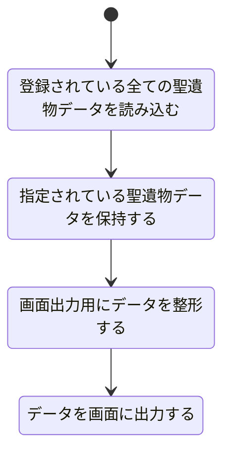

# 聖遺物詳細表示機能設計

## 機能概要

- 特定の聖遺物の詳細ステータスを確認できるようにするため

## 入力情報

なし

## 出力情報

選択した聖遺物の詳細ステータスをゲーム内 UI に近しい感じで表示する

## 処理フロー

## エラーハンドリング

| 処理ステップ                               | 想定されるエラー内容                                                                                 |
| ------------------------------------------ | ---------------------------------------------------------------------------------------------------- |
| 登録されている全ての聖遺物データを読み込む | ファイルやデータソースが存在しない JSON や CSV などの形式が不正 読み込み中に I/O エラー      |
| 指定されている聖遺物データを保持する       | 指定 ID やキーに該当するデータが存在しない 複数指定に対して一部データしか取得できない            |
| 画面出力用にデータを整形する               | 対象データの中に必要な項目（例：名前、ステータスなど）が欠落 整形ルールとの不一致                |
| データを画面に出力する                     | 出力対象の UI コンポーネントが壊れている データ量が多すぎて画面がフリーズ レンダリングの失敗 |
