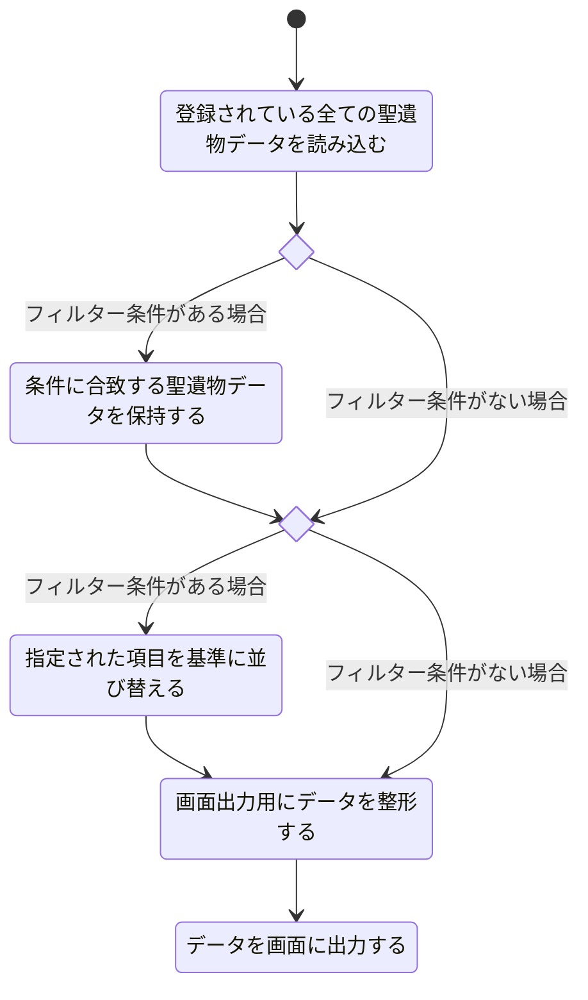

# 聖遺物一覧表示機能設計

## 機能概要

所持している聖遺物を把握しやすくするため
テーブルで表示してフィルターやソートができるようにする

## 入力情報

なし

## 出力情報

登録されている全ての聖遺物一覧表示

## 処理フロー

## エラーハンドリング

| 処理ステップ                               | 想定されるエラー内容                                                                                                         |
| ------------------------------------------ | ---------------------------------------------------------------------------------------------------------------------------- |
| 登録されている全ての聖遺物データを読み込む | ファイルが存在しない / パス間違い JSON などのデータ形式が不正 読み込み時の I/O エラー メモリ不足（データ量過多） |
| if_filter（条件分岐）                      | フィルター条件の構文ミスや未定義キーの指定 条件が複雑すぎて評価時に例外発生                                              |
| 条件に合致する聖遺物データを保持する       | フィルタ結果が空（後続の処理が無意味になる） データ構造が想定と異なりフィルター処理が失敗                                |
| if_sort（条件分岐）                        | 並び替え対象の指定が不正（存在しないキー） 昇順・降順の指定が無効                                                        |
| 指定された項目を基準に並び替える           | 並び替え対象データに欠損値がある 型が混在していて比較できない                                                            |
| 画面出力用にデータを整形する               | 整形処理に必要なフィールドが存在しない フォーマット指定ミス                                                              |
| データを画面に出力する                     | 表示先が指定されていない / UI エラー データが多すぎて表示に失敗 レンダリングエラー                                   |
