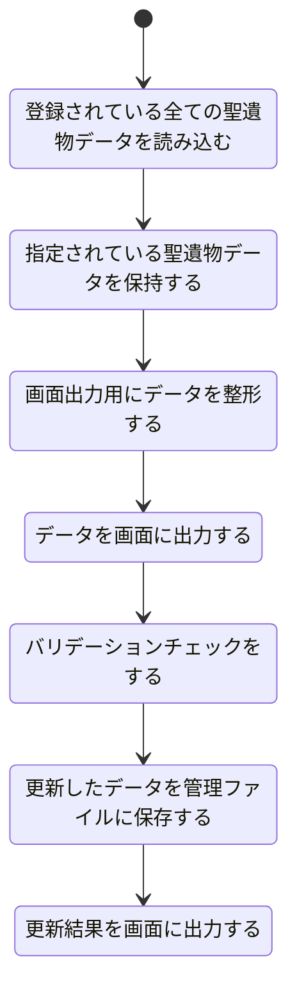

# 聖遺物更新機能設計

## 機能概要

- 登録の際に正確なデータを抽出できず間違ってしまった際に修正できるようにする

## 入力情報

- 聖遺物セット
- 聖遺物部位
- 聖遺物レアリティ
- メインオプション
- サブオプション

## 出力情報

変更された箇所を強調して聖遺物の詳細ステータスをゲーム内 UI に近しい感じで表示する

## 処理フロー

## エラーハンドリング

| 処理ステップ                               | 想定されるエラー内容                                                                                      |
| ------------------------------------------ | --------------------------------------------------------------------------------------------------------- |
| 登録されている全ての聖遺物データを読み込む | ファイルが存在しない / 拡張子間違い ファイル形式が不正（JSON 構文エラーなど） 読み込み失敗（I/O） |
| 指定されている聖遺物データを保持する       | 指定 ID が存在しない 一部の指定データが欠落している データ構造の不一致                            |
| 画面出力用にデータを整形する               | フィールド不足により整形に失敗 数値・文字列の混在によるフォーマットエラー                             |
| データを画面に出力する                     | 出力 UI が未バインド データが大きすぎて描画不能 null/undefined によるクラッシュ                   |
| バリデーションチェックをする               | 必須項目が未入力または型不一致 範囲外の値（例：会心率が 200%など） スキーマとの不一致             |
| 更新したデータを管理ファイルに保存する     | 書き込み権限エラー 書き込み対象ファイルのロック中 JSON 変換に失敗（循環参照など）                 |
| 更新結果を画面に出力する                   | 保存結果が不正（null、空など） 出力 UI が非表示またはバインドミス                                     |
