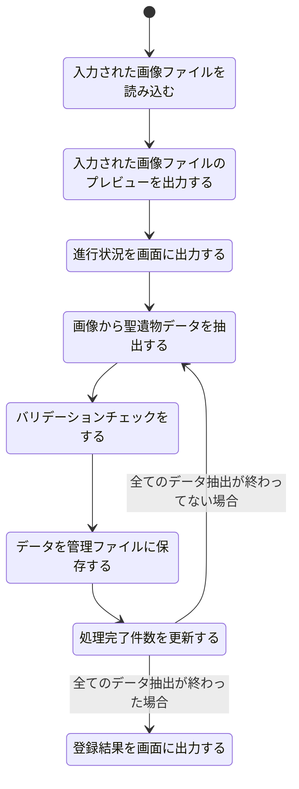
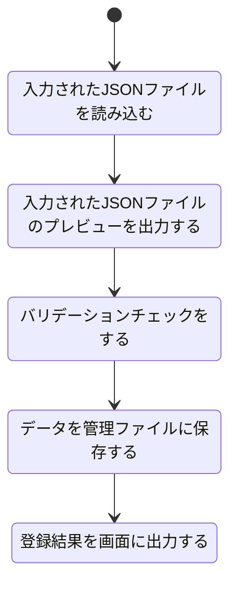

# 聖遺物登録機能設計

## 機能概要

- 聖遺物を管理しやすいように登録する
- ゲーム内画像からデータを抽出して登録する
- バックアップからの復元のために JSON ファイルからのインポートもできるようにする
- プレビューでどのファイルが選択されたのかをわかりやすくする

## 入力情報

- ゲーム内の特定のスクリーンショット画像ファイル
- JSON ファイル

## 出力情報

- 選択されたファイルのプレビュー
- 登録する聖遺物の件数

## 処理フロー

### 画像ファイルから

### JSON ファイルから

## エラーハンドリング

| 処理ステップ                                   | 想定されるエラー内容                                                                                                                                 |
| ---------------------------------------------- | ---------------------------------------------------------------------------------------------------------------------------------------------------- |
| 入力された画像ファイルを読み込む               | ファイルが存在しない / 拡張子不正 読み込み失敗（破損画像、形式未対応） メモリ不足                                                            |
| 入力された画像ファイルのプレビューを出力する   | プレビュー表示領域が未設定 / 非表示 解像度や形式によりサムネイル生成に失敗                                                                       |
| 進行状況を画面に出力する                       | UI 更新処理のタイミング不備による進捗表示遅延や欠落 進捗カウンタ未初期化                                                                         |
| 画像から聖遺物データを抽出する                 | OCR 精度の不足（誤認識、読取漏れ） レイアウト変化に対応できていない キャラ名・ステータス等の解析失敗                                         |
| バリデーションチェックをする                   | 必須フィールドが欠落 データ型・範囲の不一致 重複や不正値検出                                                                                 |
| データを管理ファイルに保存する                 | ファイル書き込み権限エラー フォーマット（JSON など）への変換失敗 同時アクセスによる競合                                                      |
| 処理完了件数を更新する                         | カウンタ変数が正しく初期化・加算されていない 並列処理中に不整合が発生                                                                            |
| 登録結果を画面に出力する                       | 出力用 UI のバインディング失敗 結果データに不正（空や null） 表示形式の整形ミス                                                              |
| 入力された JSON ファイルを読み込む             | ファイルが存在しない / パス誤り 拡張子が`.json`でない 文字コードの不一致（例: UTF-8 以外） ファイル形式不正（例: JSON として構文エラー） |
| 入力された JSON ファイルのプレビューを出力する | プレビュー表示 UI の初期化ミス JSON が巨大すぎて UI 側でトリミング不能                                                                           |
| バリデーションチェックをする                   | 必須項目の欠落 型の不一致（数値が文字列になっているなど） 不正な値（ステータス範囲外など）                                                   |
| データを管理ファイルに保存する                 | 書き込み権限不足 保存先ファイルがロックされている（他プロセス使用中） JSON への再シリアライズ失敗                                            |
| 登録結果を画面に出力する                       | 出力 UI のバインディングミス 出力データの整形ミス 保存結果が空または null                                                                    |
