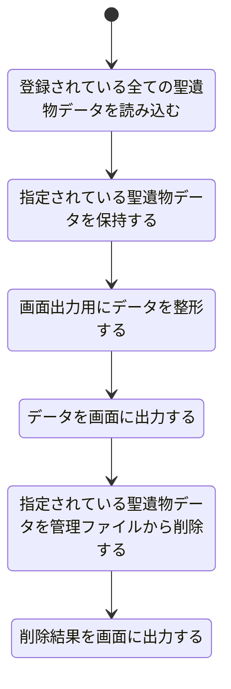

# 聖遺物削除機能設計

## 機能概要

- ゲーム内で必要なくなった聖遺物を削除して管理しやすくするため
- 削除処理をする前に確認ダイアログを表示させる

## 入力情報

なし

## 出力情報

選択した聖遺物の詳細ステータスをゲーム内 UI に近しい感じで表示する

## 処理フロー

## エラーハンドリング

| 処理ステップ                                         | 想定されるエラー内容                                                                             |
| ---------------------------------------------------- | ------------------------------------------------------------------------------------------------ |
| 登録されている全ての聖遺物データを読み込む           | ファイルが存在しない / パスエラー JSON フォーマットエラー 読み込み中の I/O エラー        |
| 指定されている聖遺物データを保持する                 | 指定された ID/キーに一致するデータが存在しない 複数件指定のうち一部しか存在しない            |
| 画面出力用にデータを整形する                         | 必要フィールドの欠落による整形ミス 整形ルールに合致しないデータの存在                        |
| データを画面に出力する                               | UI バインディング失敗 空データによるクラッシュ 非同期描画エラー                          |
| 指定されている聖遺物データを管理ファイルから削除する | 削除対象データが存在しない ファイル更新中の同時アクセス競合 ファイルの書き込み権限エラー |
| 削除結果を画面に出力する                             | 削除数が期待と一致しない（例：0 件） UI 更新に失敗 結果データが不正形式                  |
