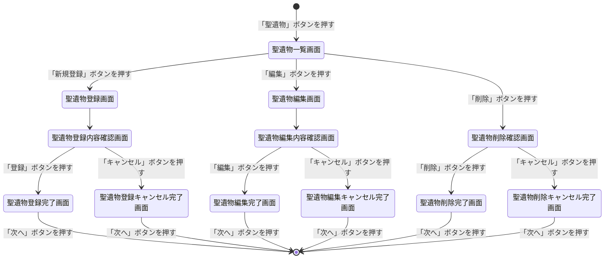

# 画面遷移図

```mermaid
stateDiagram-v2
  direction TB
  [*] --> 聖遺物一覧画面 : 「聖遺物」ボタンを押す

  聖遺物一覧画面 --> 聖遺物登録画面 : 「新規登録」ボタンを押す
  聖遺物登録画面 --> 聖遺物登録内容確認画面
  聖遺物登録内容確認画面 --> 聖遺物登録完了画面 : 「登録」ボタンを押す
  聖遺物登録内容確認画面 --> 聖遺物登録キャンセル完了画面 : 「キャンセル」ボタンを押す
  聖遺物登録完了画面 --> [*] : 「次へ」ボタンを押す
  聖遺物登録キャンセル完了画面 --> [*] : 「次へ」ボタンを押す

  聖遺物一覧画面 --> 聖遺物編集画面 : 「編集」ボタンを押す
  聖遺物編集画面 --> 聖遺物編集内容確認画面
  聖遺物編集内容確認画面 --> 聖遺物編集完了画面 : 「編集」ボタンを押す
  聖遺物編集内容確認画面 --> 聖遺物編集キャンセル完了画面 : 「キャンセル」ボタンを押す
  聖遺物編集完了画面 --> [*] : 「次へ」ボタンを押す
  聖遺物編集キャンセル完了画面 --> [*] : 「次へ」ボタンを押す

  聖遺物一覧画面 --> 聖遺物削除確認画面 : 「削除」ボタンを押す
  聖遺物削除確認画面 --> 聖遺物削除完了画面 : 「削除」ボタンを押す
  聖遺物削除確認画面 --> 聖遺物削除キャンセル完了画面 : 「キャンセル」ボタンを押す
  聖遺物削除完了画面 --> [*] : 「次へ」ボタンを押す
  聖遺物削除キャンセル完了画面 --> [*] : 「次へ」ボタンを押す
```
