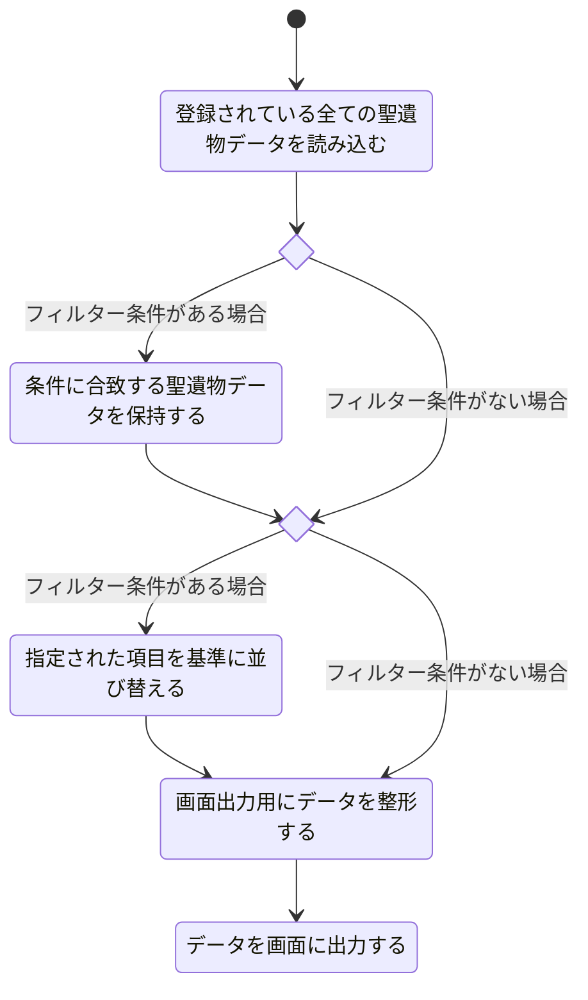
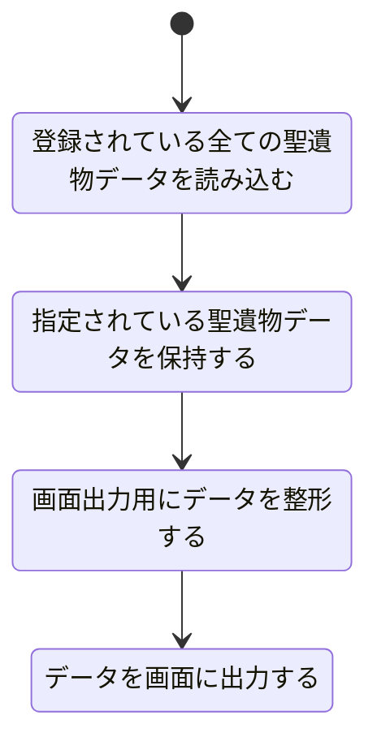
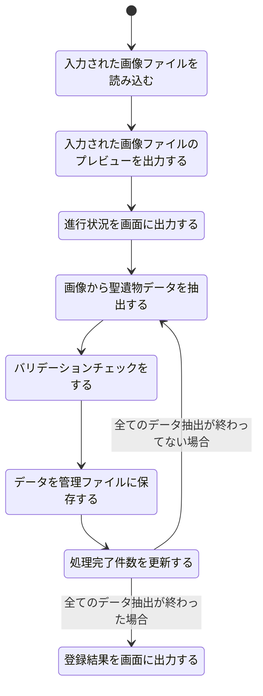
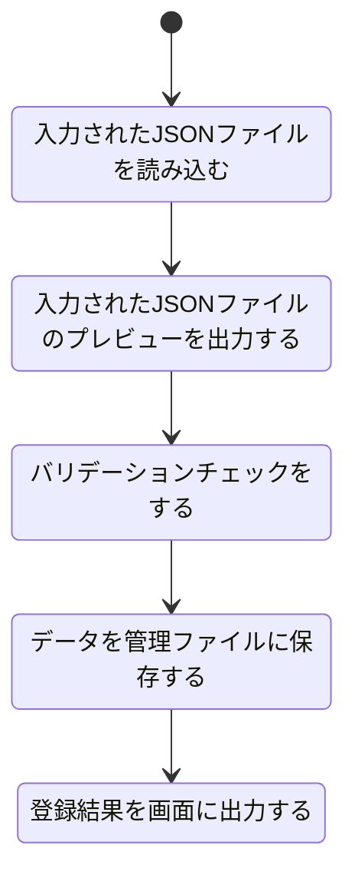
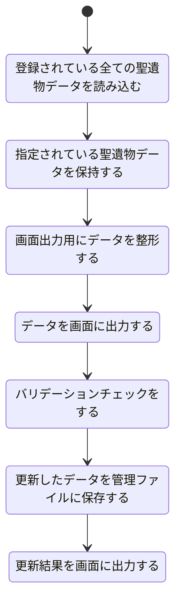
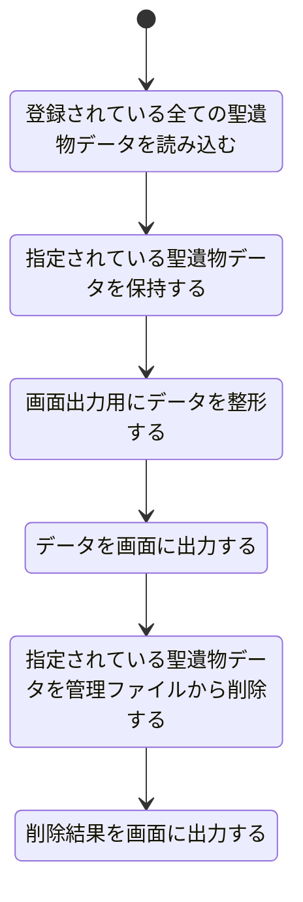

# 処理フローチャート

## 一覧表示機能

```mermaid
stateDiagram-v2
  direction TB

  state if_filter <<choice>>
  state if_sort <<choice>>

  [*] --> 登録されている全ての聖遺物データを読み込む
  登録されている全ての聖遺物データを読み込む --> if_filter
  if_filter --> 条件に合致する聖遺物データを保持する : フィルター条件がある場合
  条件に合致する聖遺物データを保持する --> if_sort
  if_filter --> if_sort : フィルター条件がない場合
  if_sort --> 指定された項目を基準に並び替える : フィルター条件がある場合
  指定された項目を基準に並び替える --> 画面出力用にデータを整形する
  if_sort --> 画面出力用にデータを整形する : フィルター条件がない場合
  画面出力用にデータを整形する --> データを画面に出力する
```

## 詳細表示機能

```mermaid
stateDiagram-v2
  direction TB

  [*] --> 登録されている全ての聖遺物データを読み込む
  登録されている全ての聖遺物データを読み込む --> 指定されている聖遺物データを保持する
  指定されている聖遺物データを保持する -->  画面出力用にデータを整形する
  画面出力用にデータを整形する --> データを画面に出力する
```

## 登録機能

### 画像ファイルから

```mermaid
stateDiagram-v2
  direction TB

  [*] --> 入力された画像ファイルを読み込む
  入力された画像ファイルを読み込む --> 入力された画像ファイルのプレビューを出力する
  入力された画像ファイルのプレビューを出力する --> 進行状況を画面に出力する
  進行状況を画面に出力する -->  画像から聖遺物データを抽出する
  画像から聖遺物データを抽出する --> バリデーションチェックをする
  バリデーションチェックをする --> データを管理ファイルに保存する
  データを管理ファイルに保存する --> 処理完了件数を更新する
  処理完了件数を更新する --> 登録結果を画面に出力する : 全てのデータ抽出が終わった場合
  処理完了件数を更新する --> 画像から聖遺物データを抽出する : 全てのデータ抽出が終わってない場合
```

### JSON ファイルから

```mermaid
stateDiagram-v2
  direction TB

  [*] --> 入力されたJSONファイルを読み込む
  入力されたJSONファイルを読み込む --> 入力されたJSONファイルのプレビューを出力する
  入力されたJSONファイルのプレビューを出力する --> バリデーションチェックをする
  バリデーションチェックをする --> データを管理ファイルに保存する
  データを管理ファイルに保存する --> 登録結果を画面に出力する
```

## 更新機能

```mermaid
stateDiagram-v2
  direction TB

  [*] --> 登録されている全ての聖遺物データを読み込む
  登録されている全ての聖遺物データを読み込む --> 指定されている聖遺物データを保持する
  指定されている聖遺物データを保持する -->  画面出力用にデータを整形する
  画面出力用にデータを整形する --> データを画面に出力する
  データを画面に出力する --> バリデーションチェックをする
  バリデーションチェックをする --> 更新したデータを管理ファイルに保存する
  更新したデータを管理ファイルに保存する --> 更新結果を画面に出力する
```

## 削除機能

```mermaid
stateDiagram-v2
  direction TB

  [*] --> 登録されている全ての聖遺物データを読み込む
  登録されている全ての聖遺物データを読み込む --> 指定されている聖遺物データを保持する
  指定されている聖遺物データを保持する -->  画面出力用にデータを整形する
  画面出力用にデータを整形する --> データを画面に出力する
  データを画面に出力する --> 指定されている聖遺物データを管理ファイルから削除する
  指定されている聖遺物データを管理ファイルから削除する --> 削除結果を画面に出力する
```
