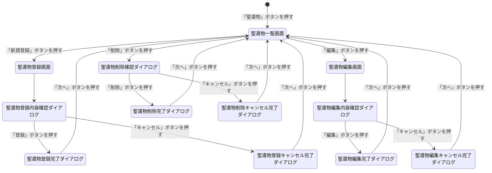

# 遷移図

```mermaid
stateDiagram-v2
  direction tb
  [*] --> 聖遺物一覧画面 : 「聖遺物」ボタンを押す
  聖遺物一覧画面 --> 聖遺物登録画面 : 「新規登録」ボタンを押す
  聖遺物一覧画面 --> 聖遺物編集画面 : 「編集」ボタンを押す
  聖遺物一覧画面 --> 聖遺物削除確認ダイアログ : 「削除」ボタンを押す
  聖遺物登録画面 --> 聖遺物登録内容確認ダイアログ
  聖遺物登録内容確認ダイアログ --> 聖遺物登録完了ダイアログ : 「登録」ボタンを押す
  聖遺物登録内容確認ダイアログ --> 聖遺物登録キャンセル完了ダイアログ : 「キャンセル」ボタンを押す
  聖遺物登録完了ダイアログ --> 聖遺物一覧画面 : 「次へ」ボタンを押す
  聖遺物登録キャンセル完了ダイアログ --> 聖遺物一覧画面 : 「次へ」ボタンを押す
  聖遺物編集画面 --> 聖遺物編集内容確認ダイアログ
  聖遺物編集内容確認ダイアログ --> 聖遺物編集完了ダイアログ : 「編集」ボタンを押す
  聖遺物編集内容確認ダイアログ --> 聖遺物編集キャンセル完了ダイアログ : 「キャンセル」ボタンを押す
  聖遺物編集完了ダイアログ --> 聖遺物一覧画面 : 「次へ」ボタンを押す
  聖遺物編集キャンセル完了ダイアログ --> 聖遺物一覧画面 : 「次へ」ボタンを押す
  聖遺物削除確認ダイアログ --> 聖遺物削除完了ダイアログ : 「削除」ボタンを押す
  聖遺物削除確認ダイアログ --> 聖遺物削除キャンセル完了ダイアログ : 「キャンセル」ボタンを押す
  聖遺物削除完了ダイアログ --> 聖遺物一覧画面 : 「次へ」ボタンを押す
  聖遺物削除キャンセル完了ダイアログ --> 聖遺物一覧画面 : 「次へ」ボタンを押す
```
